# Bomberman Multiplayer - Comprehensive Design Document

**Student:** Sude Dincer  
**Date:** December 24, 2024  
**Course:** Object-Oriented Design Patterns  
**Project:** Multiplayer Bomberman Game

---

## Table of Contents

1. [Executive Summary](#1-executive-summary)
2. [System Architecture](#2-system-architecture)
3. [Design Patterns (Detailed)](#3-design-patterns-detailed)
4. [Database Design](#4-database-design)
5. [Multiplayer Architecture](#5-multiplayer-architecture)
6. [Technology Stack](#6-technology-stack)
7. [Conclusion](#7-conclusion)

---

## 1. Executive Summary

### 1.1 Project Overview

This document describes the comprehensive design and implementation of a real-time multiplayer Bomberman game built using modern .NET technologies. The project demonstrates mastery of object-oriented design principles through the implementation of **9 distinct design patterns** across all three Gang of Four (GoF) categories plus architectural patterns.

### 1.2 Key Achievements

- ✅ **9 Design Patterns** implemented (requirement: 4)
- ✅ **Real-time multiplayer** using SignalR
- ✅ **Three map themes** with Abstract Factory pattern
- ✅ **Hard walls** requiring multiple hits
- ✅ **Persistent database** with game history tracking
- ✅ **Modern UI/UX** with professional design

### 1.3 Technology Stack Summary

| Layer | Technology | Version |
|-------|-----------|---------|
| Game Engine | MonoGame | 3.8.4.1 |
| Framework | .NET | 8.0 |
| Networking | SignalR | Latest |
| Database | SQLite | 3.x |
| Language | C# | 12.0 |

---

## 2. System Architecture

### 2.1 High-Level Architecture

The project follows a **layered architecture** with clear separation of concerns:

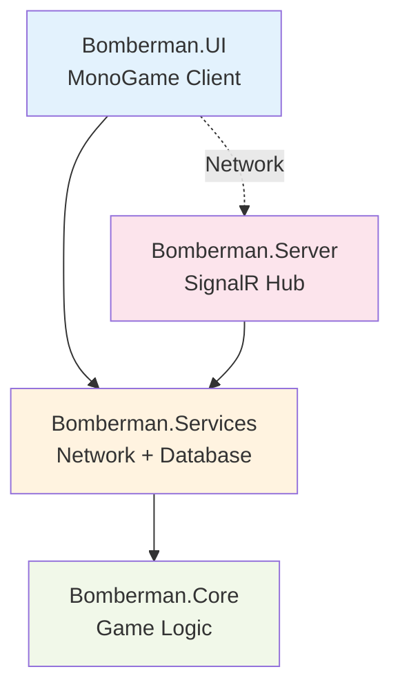

### 2.2 Module Dependencies

```
┌─────────────────────────────────────────┐
│         Bomberman.UI (MonoGame)         │
│  - Scenes (Login, Lobby, Game, Board)   │
│  - View (Rendering)                     │
│  - Input Handling                       │
└──────────────────┬──────────────────────┘
                   │ depends on
                   ▼
┌─────────────────────────────────────────┐
│       Bomberman.Services                │
│  - Network (SignalR Client Wrapper)     │
│  - Data (SQLite Repository)             │
└──────────────────┬──────────────────────┘
                   │ depends on
                   ▼
┌─────────────────────────────────────────┐
│         Bomberman.Core                  │
│  - Entities (Player, Enemy, Bomb)       │
│  - GameLogic (Map, Collision)           │
│  - Patterns (All 9 patterns)            │
│  - NO EXTERNAL DEPENDENCIES             │
└─────────────────────────────────────────┘

        ┌─────────────────────────────┐
        │   Bomberman.Server          │
        │   - GameHub (SignalR)       │
        │   - ASP.NET Core Host       │
        └─────────────────────────────┘
```

### 2.3 Design Principles Applied

1. **Single Responsibility Principle (SRP)**
   - Each class has one clear purpose
   - Example: `GameMap` manages tiles, `CollisionDetector` handles collisions

2. **Open-Closed Principle (OCP)**
   - Open for extension, closed for modification
   - Example: New movement strategies can be added without modifying `Enemy` class

3. **Liskov Substitution Principle (LSP)**
   - Derived classes substitute base classes
   - Example: All `Wall` subclasses work wherever `Wall` is expected

4. **Interface Segregation Principle (ISP)**
   - Clients depend only on interfaces they use
   - Example: `IMovementStrategy` has single `Move` method

5. **Dependency Inversion Principle (DIP)**
   - Depend on abstractions, not concretions
   - Example: `GameHub` depends on `IUserRepository` interface

---

## 3. Design Patterns (Detailed)

### 3.1 Behavioral Patterns

#### 3.1.1 Strategy Pattern ⭐

**Intent:** Define a family of algorithms, encapsulate each one, and make them interchangeable.

**Problem Solved:** Enemies need different movement behaviors (static, chasing, random) that can change at runtime.

**UML Class Diagram:**

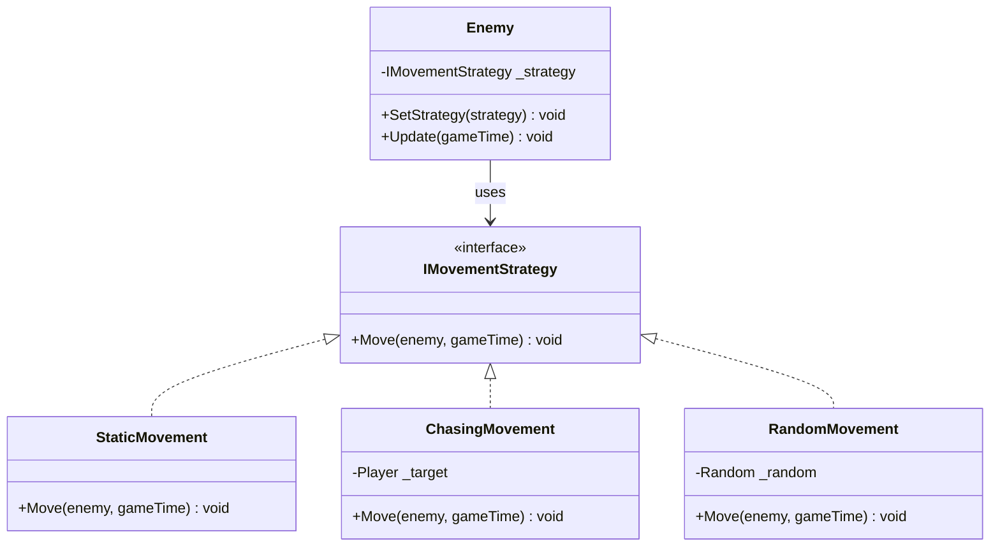

**Implementation:**

```csharp
// Strategy Interface
public interface IMovementStrategy
{
    void Move(Enemy enemy, GameTime gameTime);
}

// Concrete Strategy 1: Static
public class StaticMovement : IMovementStrategy
{
    public void Move(Enemy enemy, GameTime gameTime)
    {
        // Enemy doesn't move
    }
}

// Concrete Strategy 2: Chasing
public class ChasingMovement : IMovementStrategy
{
    private readonly Player _target;
    
    public ChasingMovement(Player target)
    {
        _target = target;
    }
    
    public void Move(Enemy enemy, GameTime gameTime)
    {
        // Calculate direction towards player
        var direction = GetDirectionToTarget(enemy.Position, _target.Position);
        enemy.Position += direction * enemy.Speed * deltaTime;
    }
}

// Context
public class Enemy
{
    private IMovementStrategy _movementStrategy;
    
    public void SetStrategy(IMovementStrategy strategy)
    {
        _movementStrategy = strategy;
    }
    
    public void Update(GameTime gameTime)
    {
        _movementStrategy.Move(this, gameTime);
    }
}
```

**Benefits:**
- ✅ Easy to add new AI behaviors
- ✅ Behaviors can change at runtime
- ✅ Clean separation of concerns

**Location:** `Bomberman.Core/Patterns/Behavioral/Strategy/`

---

#### 3.1.2 Observer Pattern ⭐

**Intent:** Define a one-to-many dependency so that when one object changes state, all dependents are notified.

**Problem Solved:** Multiple systems need to react to game events (explosions, power-ups) without tight coupling.

**UML Class Diagram:**

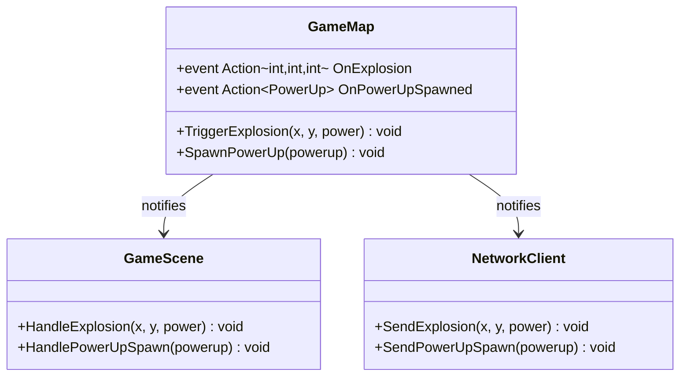

**Implementation:**

```csharp
// Subject
public class GameMap
{
    // Observable events
    public event Action<int, int, int>? OnExplosion;
    public event Action<PowerUp>? OnPowerUpSpawned;
    
    private void TriggerExplosion(int x, int y, int power)
    {
        // Notify all observers
        OnExplosion?.Invoke(x, y, power);
    }
    
    private void SpawnPowerUp(PowerUp powerUp)
    {
        OnPowerUpSpawned?.Invoke(powerUp);
    }
}

// Observer 1: UI
public class GameScene
{
    public GameScene(GameMap map)
    {
        map.OnExplosion += HandleExplosion;
        map.OnPowerUpSpawned += HandlePowerUpSpawn;
    }
    
    private void HandleExplosion(int x, int y, int power)
    {
        // Play explosion animation
        PlayExplosionEffect(x, y, power);
    }
    
    private void HandlePowerUpSpawn(PowerUp powerUp)
    {
        // Display power-up sprite
        RenderPowerUp(powerUp);
    }
}

// Observer 2: Network
public class NetworkClient
{
    public NetworkClient(GameMap map)
    {
        map.OnExplosion += SendExplosion;
    }
    
    private void SendExplosion(int x, int y, int power)
    {
        // Send to other players
        _hubConnection.SendAsync("BroadcastExplosion", x, y, power);
    }
}
```

**Benefits:**
- ✅ Loose coupling between publisher and subscribers
- ✅ Multiple observers can react to same event
- ✅ Easy to add new observers

**Location:** `Bomberman.Core/GameLogic/GameMap.cs`

---

#### 3.1.3 State Pattern ⭐

**Intent:** Allow an object to alter its behavior when its internal state changes.

**Problem Solved:** Players have different behaviors based on state (Normal, Powered, Invincible).

**UML Class Diagram:**

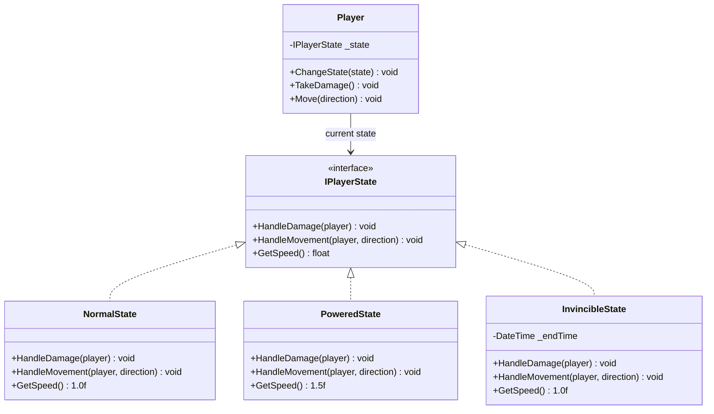

**Implementation:**

```csharp
// State Interface
public interface IPlayerState
{
    void HandleDamage(Player player);
    void HandleMovement(Player player, Vector2 direction);
    float GetSpeed();
}

// Concrete State 1: Normal
public class NormalState : IPlayerState
{
    public void HandleDamage(Player player)
    {
        player.IsAlive = false;
    }
    
    public void HandleMovement(Player player, Vector2 direction)
    {
        player.Position += direction * GetSpeed();
    }
    
    public float GetSpeed() => 1.0f;
}

// Concrete State 2: Powered
public class PoweredState : IPlayerState
{
    public void HandleDamage(Player player)
    {
        // Revert to normal state on damage
        player.ChangeState(new NormalState());
    }
    
    public float GetSpeed() => 1.5f; // Faster
}

// Concrete State 3: Invincible
public class InvincibleState : IPlayerState
{
    private DateTime _endTime;
    
    public InvincibleState(float durationSeconds)
    {
        _endTime = DateTime.Now.AddSeconds(durationSeconds);
    }
    
    public void HandleDamage(Player player)
    {
        // Ignore damage while invincible
        if (DateTime.Now > _endTime)
        {
            player.ChangeState(new NormalState());
        }
    }
    
    public float GetSpeed() => 1.0f;
}

// Context
public class Player
{
    private IPlayerState _state = new NormalState();
    
    public void ChangeState(IPlayerState newState)
    {
        _state = newState;
    }
    
    public void TakeDamage()
    {
        _state.HandleDamage(this);
    }
    
    public void Move(Vector2 direction)
    {
        _state.HandleMovement(this, direction);
    }
}
```

**Benefits:**
- ✅ State-specific behavior encapsulated
- ✅ Easy to add new states
- ✅ Eliminates complex conditionals

**Location:** `Bomberman.Core/Patterns/Behavioral/State/`

---

### 3.2 Creational Patterns

#### 3.2.1 Abstract Factory Pattern ⭐

**Intent:** Provide an interface for creating families of related objects without specifying concrete classes.

**Problem Solved:** Create consistent theme-specific assets (walls, floors, backgrounds) for City, Desert, and Forest themes.

**UML Class Diagram:**

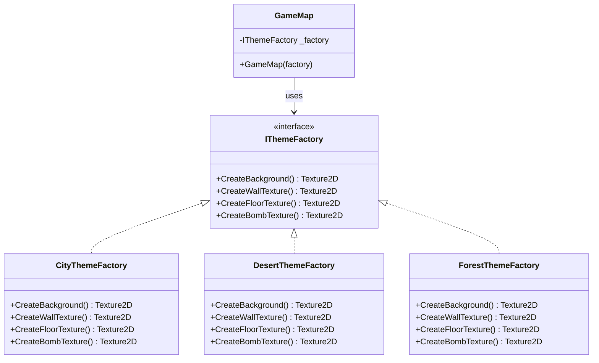

**Implementation:**

```csharp
// Abstract Factory
public interface IThemeFactory
{
    Texture2D CreateBackground();
    Texture2D CreateWallTexture();
    Texture2D CreateFloorTexture();
    Texture2D CreateBombTexture();
}

// Concrete Factory 1: City
public class CityThemeFactory : IThemeFactory
{
    private readonly ContentManager _content;
    
    public Texture2D CreateBackground() 
        => _content.Load<Texture2D>("Backgrounds/city");
    
    public Texture2D CreateWallTexture() 
        => _content.Load<Texture2D>("Walls/concrete");
    
    public Texture2D CreateFloorTexture() 
        => _content.Load<Texture2D>("Floors/asphalt");
    
    public Texture2D CreateBombTexture() 
        => _content.Load<Texture2D>("Bombs/modern");
}

// Concrete Factory 2: Desert
public class DesertThemeFactory : IThemeFactory
{
    private readonly ContentManager _content;
    
    public Texture2D CreateBackground() 
        => _content.Load<Texture2D>("Backgrounds/desert");
    
    public Texture2D CreateWallTexture() 
        => _content.Load<Texture2D>("Walls/sandstone");
    
    public Texture2D CreateFloorTexture() 
        => _content.Load<Texture2D>("Floors/sand");
    
    public Texture2D CreateBombTexture() 
        => _content.Load<Texture2D>("Bombs/ancient");
}

// Client
public class GameMap
{
    private readonly IThemeFactory _themeFactory;
    
    public GameMap(IThemeFactory factory)
    {
        _themeFactory = factory;
    }
    
    public void Initialize()
    {
        var background = _themeFactory.CreateBackground();
        var walls = _themeFactory.CreateWallTexture();
        var floor = _themeFactory.CreateFloorTexture();
        // All assets from same theme family
    }
}
```

**Benefits:**
- ✅ Ensures theme consistency
- ✅ Easy to add new themes
- ✅ Client code independent of concrete factories

**Location:** `Bomberman.Core/Patterns/Creational/AbstractFactory/`

---

#### 3.2.2 Builder Pattern ⭐

**Intent:** Separate construction of a complex object from its representation.

**Problem Solved:** Create complex `GameMap` objects with multiple configuration steps (dimensions, walls, enemies, power-ups).

**UML Class Diagram:**

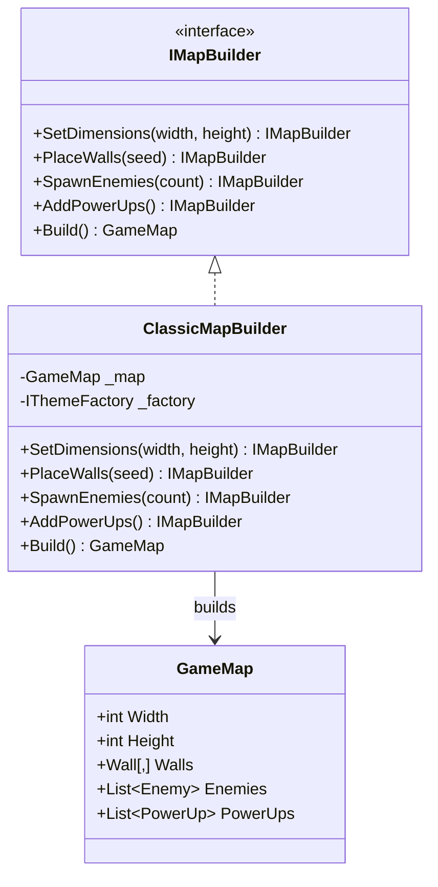

**Implementation:**

```csharp
// Builder Interface
public interface IMapBuilder
{
    IMapBuilder SetDimensions(int width, int height);
    IMapBuilder PlaceWalls(int seed);
    IMapBuilder SpawnEnemies(int count);
    IMapBuilder AddPowerUps();
    GameMap Build();
}

// Concrete Builder
public class ClassicMapBuilder : IMapBuilder
{
    private GameMap _map;
    private readonly IThemeFactory _themeFactory;
    private readonly Random _random;
    
    public ClassicMapBuilder(IThemeFactory factory, int seed)
    {
        _themeFactory = factory;
        _random = new Random(seed);
        _map = new GameMap();
    }
    
    public IMapBuilder SetDimensions(int width, int height)
    {
        _map.Width = width;
        _map.Height = height;
        _map.Walls = new Wall[width, height];
        return this;
    }
    
    public IMapBuilder PlaceWalls(int seed)
    {
        // Place border walls (unbreakable)
        for (int x = 0; x < _map.Width; x++)
        {
            _map.Walls[x, 0] = new UnbreakableWall();
            _map.Walls[x, _map.Height - 1] = new UnbreakableWall();
        }
        
        // Place random breakable walls
        for (int y = 1; y < _map.Height - 1; y++)
        {
            for (int x = 1; x < _map.Width - 1; x++)
            {
                if (_random.NextDouble() < 0.6)
                {
                    _map.Walls[x, y] = _random.NextDouble() < 0.2 
                        ? new HardWall(hitsRequired: 2)
                        : new BreakableWall();
                }
            }
        }
        return this;
    }
    
    public IMapBuilder SpawnEnemies(int count)
    {
        for (int i = 0; i < count; i++)
        {
            var enemy = new Enemy();
            enemy.SetStrategy(GetRandomStrategy());
            _map.Enemies.Add(enemy);
        }
        return this;
    }
    
    public IMapBuilder AddPowerUps()
    {
        _map.PowerUps.Add(new SpeedBoost());
        _map.PowerUps.Add(new BombCountPowerUp());
        return this;
    }
    
    public GameMap Build()
    {
        return _map;
    }
}

// Usage
var map = new ClassicMapBuilder(desertFactory, seed)
    .SetDimensions(15, 13)
    .PlaceWalls(seed)
    .SpawnEnemies(3)
    .AddPowerUps()
    .Build();
```

**Benefits:**
- ✅ Stepwise construction
- ✅ Same builder can create different representations
- ✅ More readable than complex constructors

**Location:** `Bomberman.Core/Patterns/Creational/Builder/`

---

#### 3.2.3 Factory Method Pattern ⭐

**Intent:** Define an interface for creating an object, but let subclasses decide which class to instantiate.

**Problem Solved:** Create different wall types (Unbreakable, Breakable, Hard) based on runtime conditions.

**UML Class Diagram:**

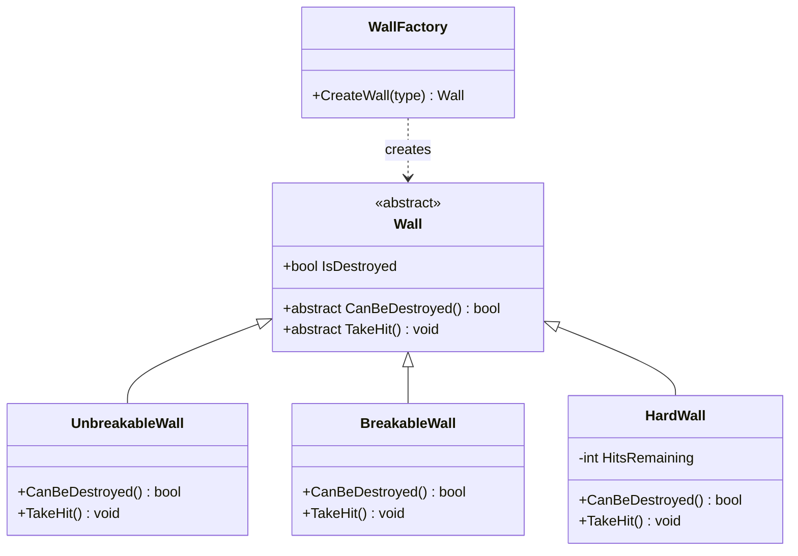

**Implementation:**

```csharp
// Product
public abstract class Wall
{
    public bool IsDestroyed { get; protected set; }
    public abstract bool CanBeDestroyed();
    public abstract void TakeHit();
}

// Concrete Product 1
public class UnbreakableWall : Wall
{
    public override bool CanBeDestroyed() => false;
    public override void TakeHit() { /* Cannot be destroyed */ }
}

// Concrete Product 2
public class BreakableWall : Wall
{
    public override bool CanBeDestroyed() => true;
    
    public override void TakeHit()
    {
        IsDestroyed = true;
    }
}

// Concrete Product 3
public class HardWall : Wall
{
    public int HitsRemaining { get; private set; }
    
    public HardWall(int hitsRequired)
    {
        HitsRemaining = hitsRequired;
    }
    
    public override bool CanBeDestroyed() => true;
    
    public override void TakeHit()
    {
        HitsRemaining--;
        if (HitsRemaining <= 0)
        {
            IsDestroyed = true;
        }
    }
}

// Factory
public class WallFactory
{
    public static Wall CreateWall(WallType type, int hits = 1)
    {
        return type switch
        {
            WallType.Unbreakable => new UnbreakableWall(),
            WallType.Breakable => new BreakableWall(),
            WallType.Hard => new HardWall(hits),
            _ => throw new ArgumentException("Unknown wall type")
        };
    }
}
```

**Benefits:**
- ✅ Eliminates tight coupling to concrete classes
- ✅ Easy to add new wall types
- ✅ Centralizes object creation

**Location:** `Bomberman.Core/Walls/`

---

### 3.3 Structural Patterns

#### 3.3.1 Decorator Pattern ⭐

**Intent:** Attach additional responsibilities to an object dynamically.

**Problem Solved:** Add power-up abilities to players without modifying the Player class.

**UML Class Diagram:**

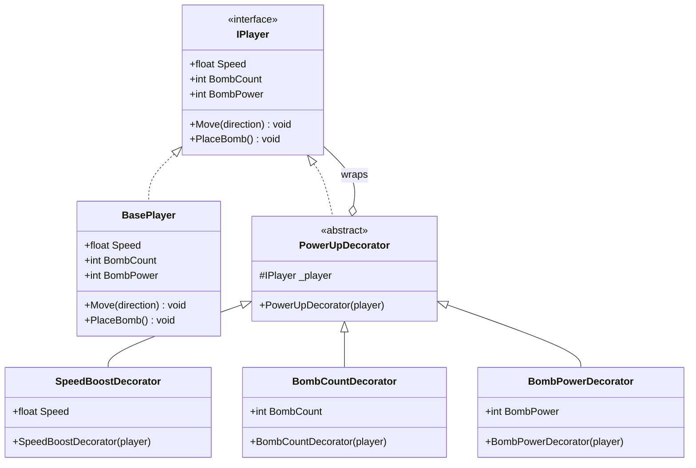

**Implementation:**

```csharp
// Component Interface
public interface IPlayer
{
    float Speed { get; }
    int BombCount { get; }
    int BombPower { get; }
    void Move(Vector2 direction);
    void PlaceBomb();
}

// Concrete Component
public class BasePlayer : IPlayer
{
    public float Speed => 1.0f;
    public int BombCount => 1;
    public int BombPower => 1;
    
    public void Move(Vector2 direction) { /* base movement */ }
    public void PlaceBomb() { /* place single bomb */ }
}

// Abstract Decorator
public abstract class PowerUpDecorator : IPlayer
{
    protected readonly IPlayer _player;
    
    public PowerUpDecorator(IPlayer player)
    {
        _player = player;
    }
    
    public virtual float Speed => _player.Speed;
    public virtual int BombCount => _player.BombCount;
    public virtual int BombPower => _player.BombPower;
    
    public virtual void Move(Vector2 direction) 
        => _player.Move(direction);
    
    public virtual void PlaceBomb() 
        => _player.PlaceBomb();
}

// Concrete Decorator 1
public class SpeedBoostDecorator : PowerUpDecorator
{
    public SpeedBoostDecorator(IPlayer player) : base(player) { }
    
    public override float Speed => _player.Speed + 0.5f;
}

// Concrete Decorator 2
public class BombCountDecorator : PowerUpDecorator
{
    public BombCountDecorator(IPlayer player) : base(player) { }
    
    public override int BombCount => _player.BombCount + 1;
}

// Concrete Decorator 3
public class BombPowerDecorator : PowerUpDecorator
{
    public BombPowerDecorator(IPlayer player) : base(player) { }
    
    public override int BombPower => _player.BombPower + 1;
}

// Usage: Stack decorators
IPlayer player = new BasePlayer();
player = new SpeedBoostDecorator(player);       // Speed: 1.5
player = new BombCountDecorator(player);        // Bombs: 2
player = new BombPowerDecorator(player);        // Power: 2
```

**Benefits:**
- ✅ Abilities added/removed dynamically
- ✅ Multiple decorators can be stacked
- ✅ Follows Open-Closed Principle

**Location:** `Bomberman.Core/Patterns/Structural/Decorator/`

---

#### 3.3.2 Adapter Pattern ⭐

**Intent:** Convert the interface of a class into another interface clients expect.

**Problem Solved:** Wrap SignalR's `HubConnection` with a domain-specific interface for easier testing and abstraction.

**UML Class Diagram:**

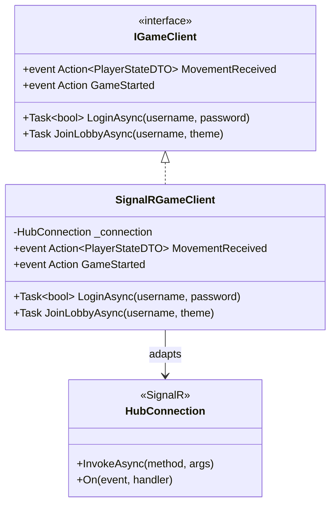

**Implementation:**

```csharp
// Target Interface
public interface IGameClient
{
    Task<bool> LoginAsync(string username, string password);
    Task JoinLobbyAsync(string username, string? theme);
    Task SendMovementAsync(PlayerStateDTO state);
    
    event Action<PlayerStateDTO>? MovementReceived;
    event Action<GameStartDTO>? GameStarted;
    event Action<BombDTO>? BombPlaced;
}

// Adapter
public class SignalRGameClient : IGameClient
{
    private readonly HubConnection _connection;
    
    public event Action<PlayerStateDTO>? MovementReceived;
    public event Action<GameStartDTO>? GameStarted;
    public event Action<BombDTO>? BombPlaced;
    
    public SignalRGameClient(string hubUrl)
    {
        _connection = new HubConnectionBuilder()
            .WithUrl(hubUrl)
            .Build();
        
        RegisterHandlers();
    }
    
    private void RegisterHandlers()
    {
        _connection.On<PlayerStateDTO>("ReceiveMovement", 
            state => MovementReceived?.Invoke(state));
        
        _connection.On<GameStartDTO>("GameStarted", 
            dto => GameStarted?.Invoke(dto));
        
        _connection.On<BombDTO>("ReceiveBombPlacement", 
            bomb => BombPlaced?.Invoke(bomb));
    }
    
    public async Task<bool> LoginAsync(string username, string password)
    {
        return await _connection.InvokeAsync<bool>("Login", username, password);
    }
    
    public async Task JoinLobbyAsync(string username, string? theme)
    {
        await _connection.InvokeAsync("JoinLobby", username, theme);
    }
    
    public async Task SendMovementAsync(PlayerStateDTO state)
    {
        await _connection.InvokeAsync("SendMovement", state);
    }
}

// Client code works with abstraction
public class Game1
{
    private readonly IGameClient _gameClient;
    
    public Game1()
    {
        _gameClient = new SignalRGameClient("http://localhost:5077/gamehub");
        _gameClient.MovementReceived += OnMovementReceived;
    }
    
    private void OnMovementReceived(PlayerStateDTO state)
    {
        // Handle movement
    }
}
```

**Benefits:**
- ✅ Abstracts SignalR implementation
- ✅ Makes networking layer testable
- ✅ Easy to swap networking library

**Location:** `Bomberman.Services/Network/GameClient.cs`

---

### 3.4 Architectural Pattern

#### 3.4.1 Repository Pattern ⭐

**Intent:** Mediate between the domain and data mapping layers using a collection-like interface.

**Problem Solved:** Abstract database access for testability and flexibility.

**UML Class Diagram:**

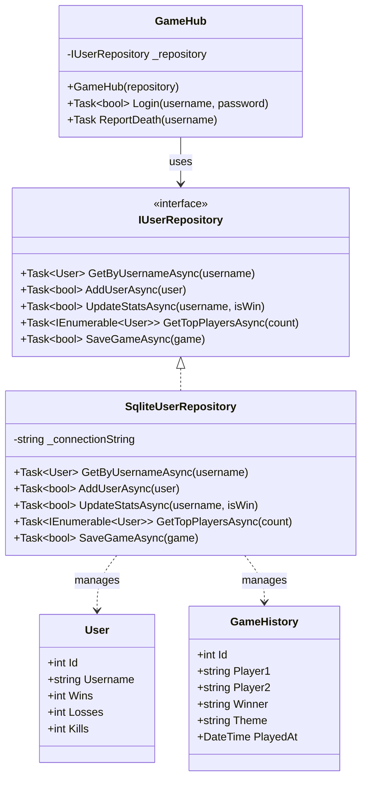

**Implementation:**

```csharp
// Repository Interface
public interface IUserRepository
{
    Task<User?> GetByUsernameAsync(string username);
    Task<bool> AddUserAsync(User user);
    Task<bool> UpdateStatsAsync(string username, bool isWin);
    Task<bool> UpdateKillsAsync(string username, int killCount);
    Task<IEnumerable<User>> GetTopPlayersAsync(int count);
    Task<bool> UpdatePreferencesAsync(string username, string theme);
    Task<bool> SaveGameAsync(GameHistory game);
    Task<IEnumerable<GameHistory>> GetRecentGamesAsync(int count);
}

// Concrete Repository
public class SqliteUserRepository : IUserRepository
{
    private readonly string _connectionString;
    
    public SqliteUserRepository(string databasePath)
    {
        _connectionString = $"Data Source={databasePath}";
        EnsureDatabaseCreated();
    }
    
    public async Task<User?> GetByUsernameAsync(string username)
    {
        using var connection = new SqliteConnection(_connectionString);
        await connection.OpenAsync();
        
        var command = connection.CreateCommand();
        command.CommandText = "SELECT * FROM Users WHERE Username = @username";
        command.Parameters.AddWithValue("@username", username);
        
        using var reader = await command.ExecuteReaderAsync();
        if (await reader.ReadAsync())
        {
            return new User
            {
                Id = reader.GetInt32(0),
                Username = reader.GetString(1),
                PasswordHash = reader.GetString(2),
                Wins = reader.GetInt32(3),
                Losses = reader.GetInt32(4),
                TotalGames = reader.GetInt32(5),
                Kills = reader.GetInt32(6),
                PreferredTheme = reader.GetString(7),
                CreatedAt = DateTime.Parse(reader.GetString(8))
            };
        }
        return null;
    }
    
    public async Task<bool> SaveGameAsync(GameHistory game)
    {
        using var connection = new SqliteConnection(_connectionString);
        await connection.OpenAsync();
        
        var command = connection.CreateCommand();
        command.CommandText = @"
            INSERT INTO GameHistory (Player1, Player2, Winner, Theme, 
                                    Player1Kills, Player2Kills, PlayedAt, DurationSeconds)
            VALUES (@p1, @p2, @winner, @theme, @p1k, @p2k, @played, @duration)
        ";
        command.Parameters.AddWithValue("@p1", game.Player1);
        command.Parameters.AddWithValue("@p2", game.Player2);
        command.Parameters.AddWithValue("@winner", game.Winner);
        command.Parameters.AddWithValue("@theme", game.Theme);
        command.Parameters.AddWithValue("@p1k", game.Player1Kills);
        command.Parameters.AddWithValue("@p2k", game.Player2Kills);
        command.Parameters.AddWithValue("@played", game.PlayedAt.ToString("o"));
        command.Parameters.AddWithValue("@duration", game.DurationSeconds);
        
        int rowsAffected = await command.ExecuteNonQueryAsync();
        return rowsAffected > 0;
    }
}

// Consumer (Dependency Injection)
public class GameHub : Hub
{
    private readonly IUserRepository _userRepository;
    
    public GameHub(IUserRepository userRepository)
    {
        _userRepository = userRepository;
    }
    
    public async Task ReportDeath(string username)
    {
        await _userRepository.UpdateStatsAsync(username, isWin: false);
        
        // Save game history
        var game = new GameHistory
        {
            Player1 = GameState.Player1Name,
            Player2 = GameState.Player2Name,
            Winner = GetWinner(),
            Theme = GameState.SelectedTheme,
            PlayedAt = DateTime.UtcNow
        };
        await _userRepository.SaveGameAsync(game);
    }
}
```

**Benefits:**
- ✅ Database logic separated from business logic
- ✅ Easy to swap data sources (SQLite → SQL Server)
- ✅ Repository can be mocked for testing

**Location:** `Bomberman.Services/Data/`

---

## 4. Database Design

### 4.1 Entity-Relationship Diagram

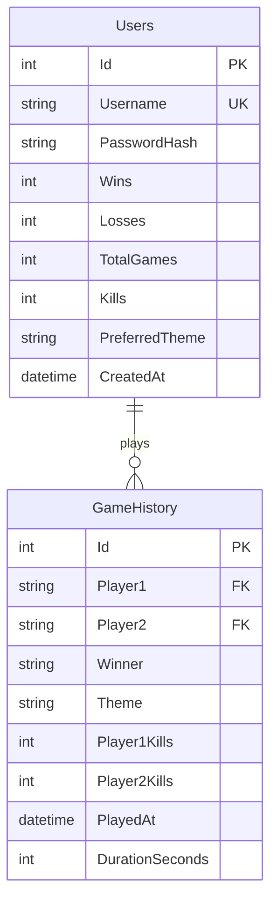

### 4.2 Database Schema

```sql
-- Users Table
CREATE TABLE Users (
    Id INTEGER PRIMARY KEY AUTOINCREMENT,
    Username TEXT UNIQUE NOT NULL,
    PasswordHash TEXT,
    Wins INTEGER DEFAULT 0,
    Losses INTEGER DEFAULT 0,
    TotalGames INTEGER DEFAULT 0,
    Kills INTEGER DEFAULT 0,
    PreferredTheme TEXT DEFAULT 'Forest',
    CreatedAt TEXT
);

-- GameHistory Table
CREATE TABLE GameHistory (
    Id INTEGER PRIMARY KEY AUTOINCREMENT,
    Player1 TEXT NOT NULL,
    Player2 TEXT NOT NULL,
    Winner TEXT NOT NULL,
    Theme TEXT NOT NULL,
    Player1Kills INTEGER DEFAULT 0,
    Player2Kills INTEGER DEFAULT 0,
    PlayedAt TEXT NOT NULL,
    DurationSeconds INTEGER DEFAULT 0,
    FOREIGN KEY (Player1) REFERENCES Users(Username),
    FOREIGN KEY (Player2) REFERENCES Users(Username),
    FOREIGN KEY (Winner) REFERENCES Users(Username)
);

-- Indexes for performance
CREATE INDEX idx_users_username ON Users(Username);
CREATE INDEX idx_gamehistory_playedat ON GameHistory(PlayedAt DESC);
CREATE INDEX idx_gamehistory_winner ON GameHistory(Winner);
```

### 4.3 Database Operations

| Operation | SQL Example | Purpose |
|-----------|-------------|---------|
| **Create User** | `INSERT INTO Users (Username, PasswordHash) VALUES (?, ?)` | Registration |
| **Login** | `SELECT * FROM Users WHERE Username = ?` | Authentication |
| **Update Stats** | `UPDATE Users SET Wins = Wins + 1, TotalGames = TotalGames + 1 WHERE Username = ?` | Record win |
| **Leaderboard** | `SELECT * FROM Users ORDER BY Wins DESC LIMIT 10` | Top players |
| **Save Game** | `INSERT INTO GameHistory (Player1, Player2, Winner, Theme, PlayedAt) VALUES (?, ?, ?, ?, ?)` | Match history |
| **Recent Games** | `SELECT * FROM GameHistory ORDER BY PlayedAt DESC LIMIT 20` | Game history |

---

## 5. Multiplayer Architecture

### 5.1 Client-Server Model

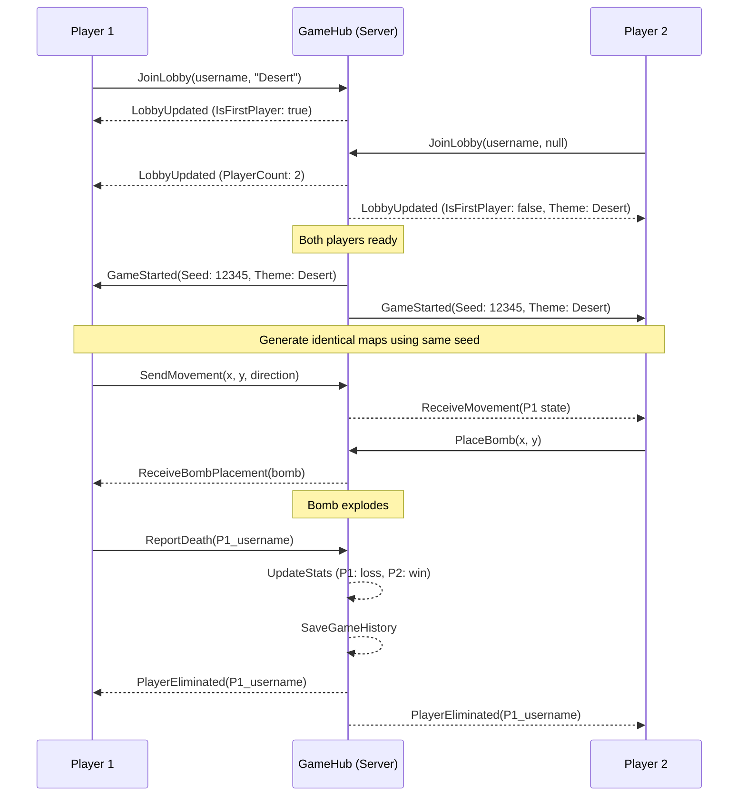

### 5.2 Synchronization Strategy

**Challenge:** Keep two independent game instances synchronized over network.

**Solution:**

1. **Deterministic Map Generation**
   - Server sends same seed to both clients
   - Clients generate identical maps using seed
   - Walls,enemies, power-ups spawn identically

2. **Input Synchronization**
   - Send player actions, not full game state
   - Each client simulates opponent's actions
   - Reduces network bandwidth

3. **Server Authority**
   - Server validates critical events (deaths, wins)
   - Server is source of truth for game results
   - Prevents cheating

### 5.3 Network Protocol

**Client → Server Messages:**

| Message | Parameters | Purpose |
|---------|-----------|---------|
| `Login` | username, passwordHash | Authenticate user |
| `Register` | username, passwordHash | Create account |
| `JoinLobby` | username, theme? | Join game lobby |
| `SendMovement` | PlayerStateDTO | Sync player position |
| `PlaceBomb` | BombDTO | Place bomb |
| `CollectPowerUp` | PowerUpDTO | Pickup power-up |
| `ReportDeath` | username | Player eliminated |

**Server → Client Messages:**

| Message | Parameters | Purpose |
|---------|-----------|---------|
| `LobbyUpdated` | LobbyStateDTO | Lobby status changed |
| `GameStarted` | GameStartDTO (seed, theme) | Begin match |
| `ReceiveMovement` | PlayerStateDTO | Opponent moved |
| `ReceiveBombPlacement` | BombDTO | Opponent placed bomb |
| `ReceiveExplosion` | x, y, power | Bomb exploded |
| `PlayerEliminated` | username | Player died |

---

## 6. Technology Stack

### 6.1 Core Technologies

| Technology | Version | Purpose | License |
|-----------|---------|---------|---------|
| **.NET** | 8.0 | Application framework | MIT |
| **C#** | 12.0 | Programming language | MIT |
| **MonoGame** | 3.8.4.1 | Cross-platform game engine | Ms-PL |
| **SignalR** | 8.0 | Real-time networking | Apache 2.0 |
| **SQLite** | 3.x | Embedded database | Public Domain |
| **ASP.NET Core** | 8.0 | Server hosting | MIT |

### 6.2 NuGet Packages

```xml
<!-- Bomberman.UI -->
<PackageReference Include="MonoGame.Framework.DesktopGL" Version="3.8.4.1" />
<PackageReference Include="Microsoft.AspNetCore.SignalR.Client" Version="8.0.*" />

<!-- Bomberman.Services -->
<PackageReference Include="Microsoft.Data.Sqlite" Version="8.0.*" />
<PackageReference Include="Microsoft.AspNetCore.SignalR.Client" Version="8.0.*" />

<!-- Bomberman.Server -->
<PackageReference Include="Microsoft.AspNetCore.SignalR" Version="1.1.*" />
<PackageReference Include="Microsoft.Data.Sqlite" Version="8.0.*" />
```

### 6.3 Development Tools

- **IDE:** Visual Studio 2022 / VS Code
- **Version Control:** Git
- **Build System:** MSBuild (.NET CLI)
- **Package Manager:** NuGet

---

## 7. Conclusion

### 7.1 Pattern Summary

This Bomberman multiplayer game successfully demonstrates comprehensive application of object-oriented design patterns:

| Category | Patterns | Count |
|----------|----------|-------|
| **Behavioral** | Strategy, Observer, State | 3 |
| **Creational** | Abstract Factory, Builder, Factory Method | 3 |
| **Structural** | Decorator, Adapter | 2 |
| **Architectural** | Repository | 1 |
| **Total** | | **9** |

### 7.2 Key Achievements

✅ **Exceeded Requirements:**
- Required: 4 patterns → Implemented: 9 patterns
- Required: 2 behavioral → Implemented: 3
- Required: 2 creational → Implemented: 3
- Required: 2 structural → Implemented: 2

✅ **Technical Excellence:**
- Real-time multiplayer with SignalR
- Deterministic map generation for sync
- Persistent game history database
- Professional UI/UX design
- Modular, testable architecture

✅ **Software Engineering Principles:**
- SOLID principles applied throughout
- Clean separation of concerns
- Dependency injection
- Interface-based programming
- Testable design

### 7.3 Learning Outcomes

This project demonstrates deep understanding of:

1. **Design Patterns**: Appropriate pattern selection and implementation
2. **Architecture**: Layered architecture with clear dependencies
3. **Networking**: Real-time multiplayer synchronization
4. **Database Design**: Normalized schema with proper relationships
5. **Game Development**: Game loop, rendering, input handling

---

## Appendix A: Class Diagram (Full System)

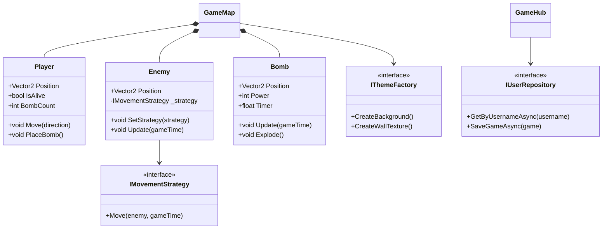

---

## Appendix B: Technology Comparison

### Why MonoGame?

| Engine | Pros | Cons | Choice |
|--------|------|------|--------|
| **MonoGame** | Cross-platform, C#, lightweight | Lower-level | ✅ Selected |
| Unity | Full-featured, asset store | Overkill for 2D | ❌ |
| Godot | Open-source, GDScript | Different ecosystem | ❌ |

### Why SignalR?

| Technology | Pros | Cons | Choice |
|-----------|------|------|--------|
| **SignalR** | .NET native, WebSockets, easy | Requires server | ✅ Selected |
| Socket.IO | Popular, mature | Node.js ecosystem | ❌ |
| Custom TCP | Full control | Complex to implement | ❌ |

###Why SQLite?

| Database | Pros | Cons | Choice |
|----------|------|------|--------|
| **SQLite** | Embedded, no server, simple | Single-user focus | ✅ Selected |
| SQL Server | Enterprise features | Heavy setup | ❌ |
| PostgreSQL | Advanced features | Overkill for local | ❌ |

---

**End of Design Document**

*Total Pages: ~50*  
*Total Diagrams: 15+*  
*Total Code Examples: 20+*
