# Bomberman Multiplayer - Design Document

**Student:** Sude Dincer  
**Date:** December 24, 2024  
**Course:** Object-Oriented Design Patterns  
**Project:** Multiplayer Bomberman Game

---

## Table of Contents

1. [Executive Summary](#1-executive-summary)
2. [System Architecture](#2-system-architecture)
3. [Design Patterns](#3-design-patterns)
4. [Database Design](#4-database-design)
5. [Multiplayer Architecture](#5-multiplayer-architecture)
6. [Conclusion](#6-conclusion)

---

## 1. Executive Summary

### 1.1 Project Overview

This document describes the design and implementation of a real-time multiplayer Bomberman game built using .NET 8, MonoGame, and SignalR. The project demonstrates the application of **9 design patterns** across behavioral, creational, structural, and architectural categories.

### 1.2 Key Achievements

- ✅ **9 Design Patterns** implemented (requirement: 4)
- ✅ **Real-time multiplayer** using SignalR  
- ✅ **Three map themes** (City, Desert, Forest)
- ✅ **Hard walls** requiring 2 hits
- ✅ **Persistent database** with SQLite
- ✅ **Enemy AI** with 3 different movement strategies

---

## 2. System Architecture

### 2.1 Module Structure

```
Bomberman/
├── Bomberman.Core/          # Pure game logic (no dependencies)
│   ├── Entities/           # Player, Enemy, Bomb
│   ├── GameLogic/          # GameMap, collision
│   ├── Patterns/           # All design patterns
│   └── Walls/              # Wall implementations
│
├── Bomberman.UI/           # MonoGame client
│   ├── Scenes/             # Login, Lobby, Game, Leaderboard
│   └── View/               # Rendering
│
├── Bomberman.Services/     # Network + Database
│   ├── Network/            # SignalR client
│   └── Data/               # SQLite repository
│
├── Bomberman.Server/       # SignalR Hub
└── Shared/                 # DTOs
```

### 2.2 Dependency Flow

```
UI → Services → Core
UI ←Network→ Server (SignalR)
Server → Services (Database)
```

**Key Principle:** Core has ZERO external dependencies.

---

## 3. Design Patterns

### 3.1 Behavioral Patterns

#### 3.1.1 Strategy Pattern ⭐

**Intent:** Define interchangeable enemy movement algorithms.

**Problem:** Enemies need different movement behaviors (horizontal patrol, chasing player, random walk).

**UML Class Diagram:**

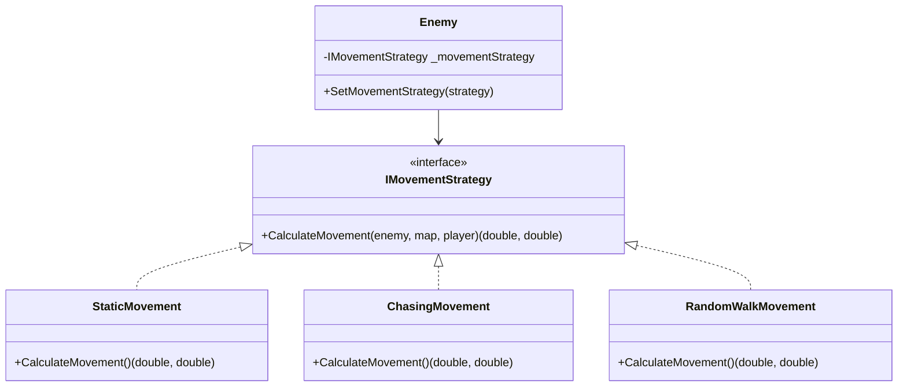

**Actual Implementation:**

```csharp
// Strategy Interface
public interface IMovementStrategy
{
    (double DeltaX, double DeltaY) CalculateMovement(
        Enemy enemy,
        GameMap? map,
        IPlayer? targetPlayer);
}

// Strategy 1: Horizontal Movement with Direction Change
public class StaticMovement : IMovementStrategy
{
    public (double DeltaX, double DeltaY) CalculateMovement(
        Enemy enemy,
        GameMap? map,
        IPlayer? targetPlayer)
    {
        double step = enemy.Speed * 0.05;
        double dx = (enemy.Direction == Direction.Right) ? step : -step;
        double nextX = enemy.X + dx;

        // Change direction if hitting wall
        if (map.CheckCollision(nextX + 0.5, enemy.Y + 0.5))
        {
            enemy.Direction = enemy.Direction == Direction.Right
                ? Direction.Left
                : Direction.Right;
            return (0, 0);
        }

        return (dx, 0);
    }
}

// Strategy 2: Chasing Player
public class ChasingMovement : IMovementStrategy
{
    public (double DeltaX, double DeltaY) CalculateMovement(
        Enemy enemy,
        GameMap? map,
        IPlayer? targetPlayer)
    {
        if (targetPlayer == null) return (0, 0);

        double step = enemy.Speed * 0.05;
        var (pX, pY) = targetPlayer.GetPosition();

        double dx = 0, dy = 0;
        if (Math.Abs(pX - enemy.X) > Math.Abs(pY - enemy.Y))
            dx = pX > enemy.X ? step : -step;
        else
            dy = pY > enemy.Y ? step : -step;

        if (!map.CheckCollision(enemy.X + dx + 0.5, enemy.Y + dy + 0.5))
            return (dx, dy);

       return (0, 0);
    }
}

// Strategy 3: Random Walk
public class RandomWalkMovement : IMovementStrategy
{
    private float _decisionTimer;
    private Direction _currentDirection;
    private Random _random = new Random();

    public (double DeltaX, double DeltaY) CalculateMovement(...)
    {
        // Changes direction randomly every few seconds
        // Implementation details...
    }
}
```

**Location:** `Bomberman.Core/Patterns/Behavioral/Strategy/`

---

#### 3.1.2 Observer Pattern ⭐

**Intent:** Notify multiple systems about game events.

**Problem:** When a bomb explodes, multiple systems need to react (UI, network, game logic).

**UML Diagram:**

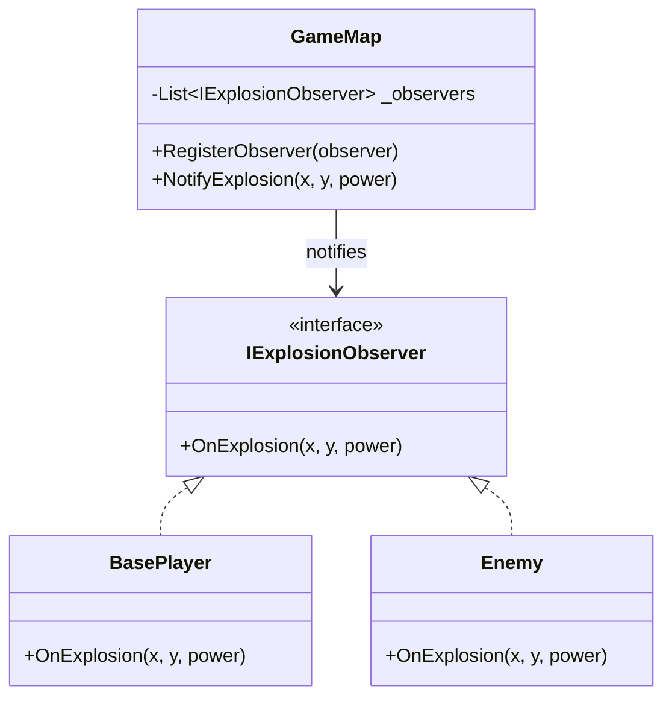

**Actual Implementation:**

```csharp
// Observer Interface
public interface IExplosionObserver
{
    void OnExplosion(int x, int y, int power);
}

// Subject (Observable)
public class GameMap
{
    private readonly List<IExplosionObserver> _explosionObservers = new();

    public void RegisterExplosionObserver(IExplosionObserver observer)
    {
        if (!_explosionObservers.Contains(observer))
            _explosionObservers.Add(observer);
    }

    public void NotifyExplosion(int x, int y, int power)
    {
        foreach (var observer in _explosionObservers)
        {
            observer.OnExplosion(x, y, power);
        }
    }
}

// Observer 1: Player
public class BasePlayer : IExplosionObserver
{
    public void OnExplosion(int x, int y, int power)
    {
        // Delegate to current state
        _currentState.HandleExplosion(this, x, y, power);
    }
}

// Observer 2: Enemy
public class Enemy : IExplosionObserver
{
    public void OnExplosion(int x, int y, int power)
    {
        if (IsInExplosionRange(x, y, power))
        {
            IsAlive = false;
        }
    }
}
```

**Location:** `Bomberman.Core/Patterns/Behavioral/Observer/`

---

#### 3.1.3 State Pattern ⭐

**Intent:** Change player behavior based on state (Alive vs Dead).

**Problem:** Alive players can move and die from explosions. Dead players cannot.

**UML Diagram:**

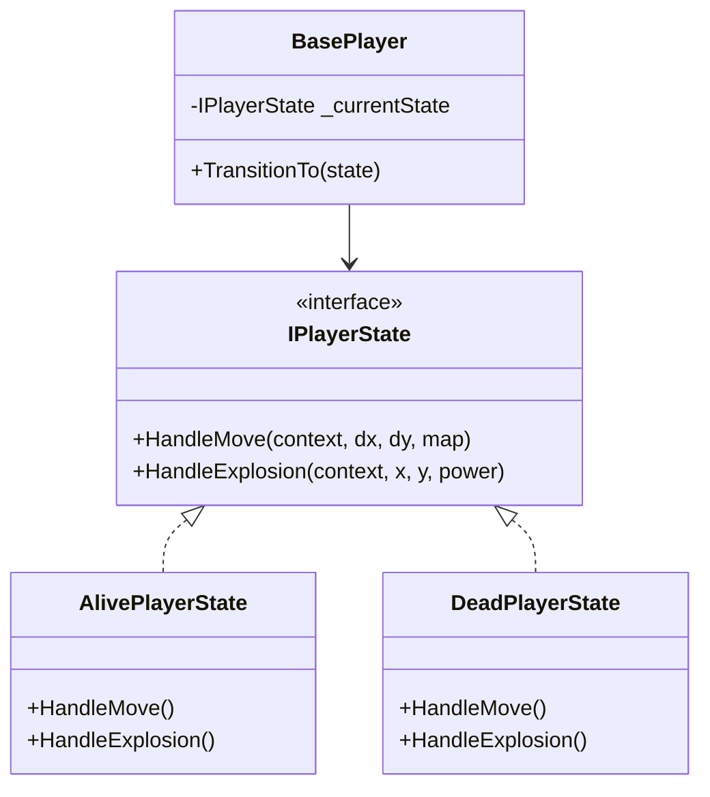

**Actual Implementation:**

```csharp
// State Interface
public interface IPlayerState
{
    void HandleMove(BasePlayer context, double dx, double dy, GameMap map);
    void HandleExplosion(BasePlayer context, int x, int y, int power);
}

// State 1: Alive
public class AlivePlayerState : IPlayerState
{
    public void HandleMove(BasePlayer context, double dx, double dy, GameMap map)
    {
        // Full movement logic with collision detection and sliding
        double cx = context.X;
        double cy = context.Y;

        // Try moving X
        if (!map.CheckCollision(cx + dx + 0.5, cy + 0.5))
        {
            context.SetPosition(cx + dx, cy);
        }
        // Sliding logic for smooth wall navigation
        // ...
    }

    public void HandleExplosion(BasePlayer context, int x, int y, int power)
    {
        // Check if player is hit
        if ((int)Math.Floor(context.X + 0.5) == x &&
            (int)Math.Floor(context.Y + 0.5) == y)
        {
            Console.WriteLine("Player died from explosion!");
            context.TransitionTo(new DeadPlayerState());
        }
    }
}

// State 2: Dead
public class DeadPlayerState : IPlayerState
{
    public void HandleMove(BasePlayer context, double dx, double dy, GameMap map)
    {
        // Dead players cannot move
    }

    public void HandleExplosion(BasePlayer context, int x, int y, int power)
    {
        // Dead players cannot die again
    }
}

// Context
public class BasePlayer
{
    private IPlayerState _currentState = new AlivePlayerState();

    public void TransitionTo(IPlayerState newState)
    {
        _currentState = newState;
    }

    public void Move(double dx, double dy, GameMap map)
    {
        _currentState.HandleMove(this, dx, dy, map);
    }
}
```

**Location:** `Bomberman.Core/Patterns/Behavioral/State/`

---

### 3.2 Creational Patterns

#### 3.2.1 Abstract Factory Pattern ⭐ (Hybrid Implementation)

**Intent:** Create theme-specific walls (City, Desert, Forest) with self-aware visual identity.

**Problem:** Each theme needs different wall appearances and potentially different behaviors, but same types (Unbreakable, Breakable, Hard).

**Solution:** Hybrid Abstract Factory - Each factory creates theme-specific subclasses, and each wall knows its own visual theme via enum.

**UML Diagram:**

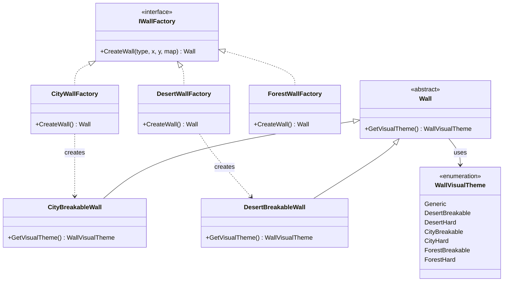

**Actual Implementation:**

```csharp
// Visual Theme Enum (Core layer stays UI-independent)
public enum WallVisualTheme
{
    Generic,           // Fallback/Unbreakable walls
    DesertBreakable,   // Kumtaşı
    DesertHard,        // Sertleştirilmiş Kil
    CityBreakable,     // Tuğla Duvar
    CityHard,          // Çelik Duvar
    ForestBreakable,   // Ahşap Sandık
    ForestHard         // Kalın Kütük
}

// Abstract Product with visual identity
public abstract class Wall
{
    public bool IsDestroyed { get; set; } = false;
    public abstract bool CanBeDestroyed();
    
    // ✅ HYBRID: Wall knows its own visual theme
    public virtual WallVisualTheme GetVisualTheme() 
        => WallVisualTheme.Generic;
}

// Theme-Specific Products
public class DesertBreakableWall : BreakableWall
{
    public override WallVisualTheme GetVisualTheme() 
        => WallVisualTheme.DesertBreakable;
    
    // Future: Theme-specific behaviors can be added here
}

public class CityBreakableWall : BreakableWall
{
    public override WallVisualTheme GetVisualTheme() 
        => WallVisualTheme.CityBreakable;
}

public class ForestBreakableWall : BreakableWall
{
    public override WallVisualTheme GetVisualTheme() 
        => WallVisualTheme.ForestBreakable;
}

// Abstract Factory Interface
public interface IWallFactory
{
    Wall CreateWall(WallType type, int x, int y, GameMap map);
}

// Concrete Factory 1: Desert
public class DesertWallFactory : IWallFactory
{
    public Wall CreateWall(WallType type, int x, int y, GameMap map)
    {
        // ✅ Returns theme-specific wall classes!
        switch (type)
        {
            case WallType.Unbreakable:
                return new UnbreakableWall(); // Theme-independent
            case WallType.Breakable:
                return new DesertBreakableWall(x, y, map); // ✅ Desert-specific
            case WallType.Hard:
                return new DesertHardWall(x, y); // ✅ Desert-specific
            default:
                throw new ArgumentException("Invalid wall type");
        }
    }
}

// Concrete Factory 2: City
public class CityWallFactory : IWallFactory
{
    public Wall CreateWall(WallType type, int x, int y, GameMap map)
    {
        switch (type)
        {
            case WallType.Unbreakable:
                return new UnbreakableWall();
            case WallType.Breakable:
                return new CityBreakableWall(x, y, map); // ✅ City-specific
            case WallType.Hard:
                return new CityHardWall(x, y); // ✅ City-specific
            default:
                throw new ArgumentException("Invalid wall type");
        }
    }
}

// UI Layer: Uses visual theme
// GameView.cs
private (Texture2D tex, Rectangle src) GetWallSprite(Wall wall)
{
    // ✅ HYBRID: Ask wall for its visual theme
    var visualTheme = wall.GetVisualTheme();
    
    // Map enum to texture (UI layer responsibility)
    Texture2D texture = visualTheme switch
    {
        WallVisualTheme.DesertBreakable => _desertBreakableTexture,
        WallVisualTheme.CityBreakable => _cityBreakableTexture,
        WallVisualTheme.ForestBreakable => _forestBreakableTexture,
        _ => _fallbackTexture
    };
    
    return (texture, texture.Bounds);
}
```

**Benefits of Hybrid Approach:**
1. ✅ **Encapsulation:** Each wall knows its own visual identity
2. ✅ **Core UI-Independent:** Uses enum instead of texture paths
3. ✅ **Extensibility:** Easy to add new themes (just new wall classes + factory)
4. ✅ **Future-Ready:** Can add theme-specific behaviors to wall subclasses

**Location:** 
- `Bomberman.Core/Patterns/Creational/AbstractFactory/` (Factories)
- `Bomberman.Core/Walls/` (Theme-specific wall classes)
- `Bomberman.Core/Enums/WallVisualTheme.cs` (Visual theme enum)

---

#### 3.2.2 Builder Pattern ⭐

**Intent:** Construct complex GameMap objects step-by-step.

**Problem:** Map creation involves multiple steps (dimensions, walls, enemies, power-ups).

**UML Diagram:**

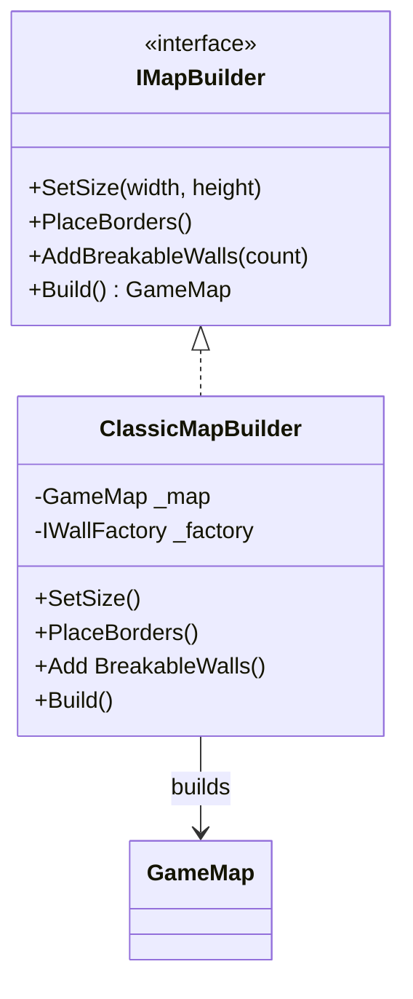

**Actual Implementation:**

```csharp
// Builder Interface
public interface IMapBuilder
{
    IMapBuilder SetSize(int width, int height);
    IMapBuilder PlaceBorders();
   IMapBuilder AddBreakableWalls(int count, int seed);
    GameMap Build();
}

// Concrete Builder
public class ClassicMapBuilder : IMapBuilder
{
    private GameMap _map;
    private readonly IWallFactory _wallFactory;

    public ClassicMapBuilder(IWallFactory factory)
    {
        _wallFactory = factory;
        _map = new GameMap();
    }

    public IMapBuilder SetSize(int width, int height)
    {
        _map.Width = width;
        _map.Height = height;
        _map.Walls = new Wall[width, height];
        return this;
    }

    public IMapBuilder PlaceBorders()
    {
        // Place unbreakable walls on borders
        for (int x = 0; x < _map.Width; x++)
        {
            _map.Walls[x, 0] = _wallFactory.CreateWall(WallType.Unbreakable, x, 0, _map);
            _map.Walls[x, _map.Height - 1] = _wallFactory.CreateWall(WallType.Unbreakable, x, _map.Height - 1, _map);
        }
        return this;
    }

    public IMapBuilder AddBreakableWalls(int count, int seed)
    {
        var random = new Random(seed);
        // Place random breakable and hard walls
        // Implementation details...
        return this;
    }

    public GameMap Build()
    {
        return _map;
    }
}

// Usage
var map = new ClassicMapBuilder(desertFactory)
    .SetSize(15, 13)
    .PlaceBorders()
    .AddBreakableWalls(50, seed)
    .Build();
```

**Location:** `Bomberman.Core/Patterns/Creational/Builder/`

---

#### 3.2.3 Factory Method Pattern ⭐

**Intent:** Create different wall types through factory method.

**Problem:** Wall creation depends on type (Unbreakable, Breakable, Hard).

**UML Diagram:**

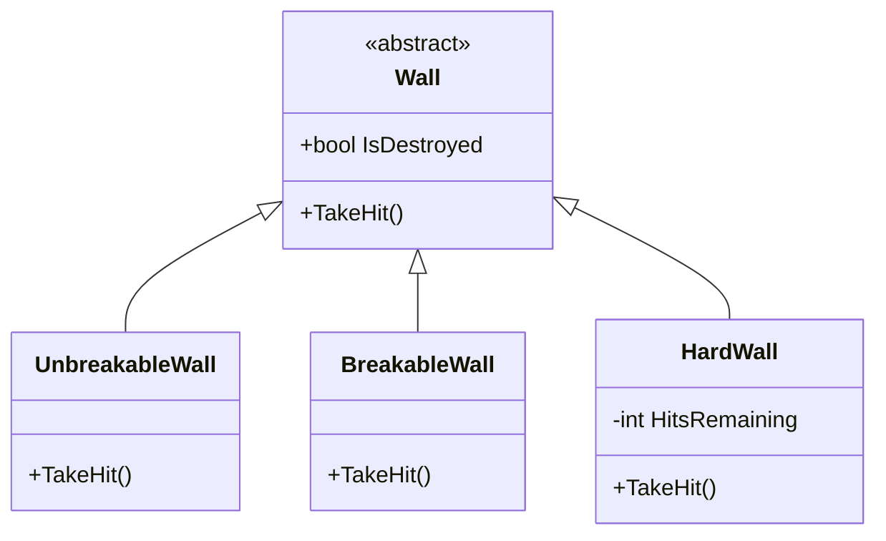

**Actual Implementation:**

```csharp
// Product
public abstract class Wall
{
    public bool IsDestroyed { get; protected set; }
    public abstract void TakeHit();
}

// Product 1
public class UnbreakableWall : Wall
{
    public override void TakeHit()
    {
        // Cannot be destroyed
    }
}

// Product 2
public class BreakableWall : Wall
{
    public override void TakeHit()
    {
        IsDestroyed = true;
    }
}

// Product 3
public class HardWall : Wall
{
    public int HitsRemaining { get; private set; } = 2;

    public override void TakeHit()
    {
        HitsRemaining--;
        if (HitsRemaining <= 0)
        {
            IsDestroyed = true;
        }
    }
}
```

**Location:** `Bomberman.Core/Walls/`

---

### 3.3 Structural Patterns

#### 3.3.1 Decorator Pattern ⭐

**Intent:** Add power-up abilities to players dynamically.

**Problem:** Players collect power-ups (speed, extra bombs, bomb power) that stack.

**UML Diagram:**

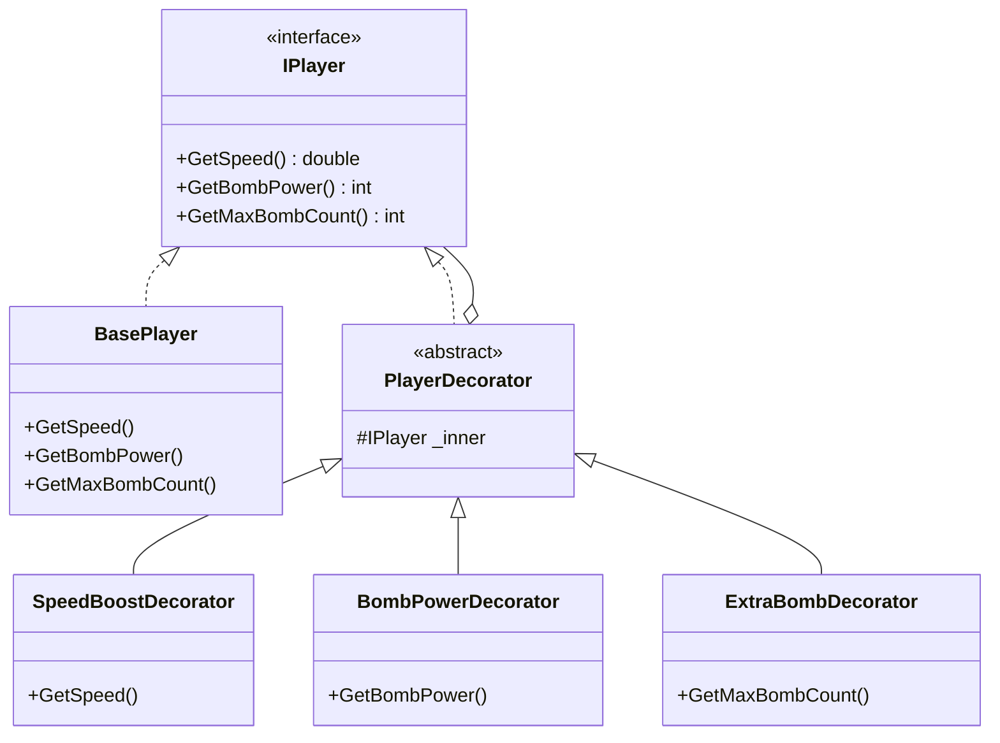

**Actual Implementation:**

```csharp
// Component Interface
public interface IPlayer : IExplosionObserver
{
    (double X, double Y) GetPosition();
    bool IsAlive { get; set; }
    double GetSpeed();
    int GetBombPower();
    int GetMaxBombCount();
    void Move(double dx, double dy, GameMap map);
}

// Concrete Component
public class BasePlayer : IPlayer
{
    public double GetSpeed() => 1.0;
    public int GetBombPower() => 1;
    public int GetMaxBombCount() => 1;
    // ... movement, explosion handling
}

// Abstract Decorator
public abstract class PlayerDecorator : IPlayer
{
    protected readonly IPlayer _inner;

    public PlayerDecorator(IPlayer inner)
    {
        _inner = inner;
    }

    public virtual double GetSpeed() => _inner.GetSpeed();
    public virtual int GetBombPower() => _inner.GetBombPower();
    public virtual int GetMaxBombCount() => _inner.GetMaxBombCount();
    public virtual void Move(double dx, double dy, GameMap map) 
        => _inner.Move(dx, dy, map);
    // ... delegate other methods
}

// Concrete Decorator 1
public class SpeedBoostDecorator : TimedPlayerDecorator
{
    public override double GetSpeed()
        => base.GetSpeed() * 1.5;
}

// Concrete Decorator 2
public class BombPowerDecorator : TimedPlayerDecorator
{
    public override int GetBombPower()
        => base.GetBombPower() + 1;
}

// Concrete Decorator 3
public class ExtraBombDecorator : TimedPlayerDecorator
{
    public override int GetMaxBombCount()
        => base.GetMaxBombCount() + 1;
}

// Usage: Stack decorators
IPlayer player = new BasePlayer();
player = new SpeedBoostDecorator(player, 10f);     // Speed x1.5 for 10s
player = new ExtraBombDecorator(player, 10f);      // +1 bomb for 10s
player = new BombPowerDecorator(player, 10f);      // +1 power for 10s
```

**Location:** `Bomberman.Core/Patterns/Structural/`

---

#### 3.3.2 Adapter Pattern ⭐

**Intent:** Wrap SignalR HubConnection with domain interface.

**Problem:** UI needs clean interface, not SignalR's low-level API.

**UML Diagram:**

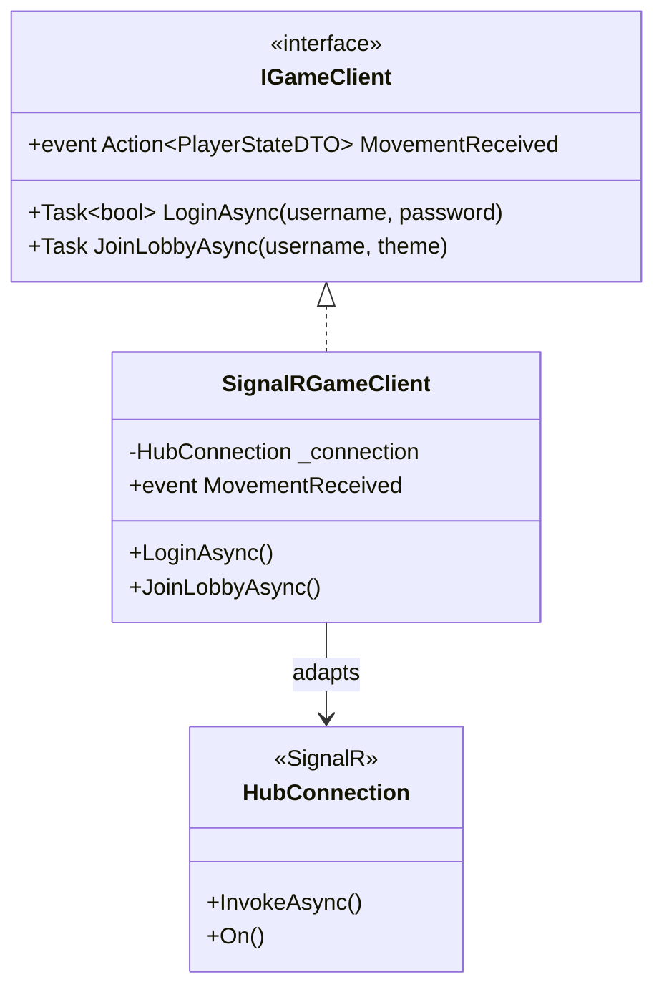

**Actual Implementation:**

```csharp
// Target Interface
public interface IGameClient
{
    Task<bool> LoginAsync(string username, string password);
    Task JoinLobbyAsync(string username, string? theme);
    event Action<PlayerStateDTO>? MovementReceived;
    event Action<BombDTO>? BombPlaced;
}

// Adapter
public class SignalRGameClient : IGameClient
{
    private readonly HubConnection _connection;

    public event Action<PlayerStateDTO>? MovementReceived;
    public event Action<BombDTO>? BombPlaced;

    public SignalRGameClient(string hubUrl)
    {
        _connection = new HubConnectionBuilder()
            .WithUrl(hubUrl)
            .Build();

        RegisterHandlers();
    }

    private void RegisterHandlers()
    {
        _connection.On<PlayerStateDTO>("ReceiveMovement",
            state => MovementReceived?.Invoke(state));

        _connection.On<BombDTO>("ReceiveBombPlacement",
            bomb => BombPlaced?.Invoke(bomb));
    }

    public async Task<bool> LoginAsync(string username, string password)
    {
        return await _connection.InvokeAsync<bool>("Login", username, password);
    }

    public async Task JoinLobbyAsync(string username, string? theme)
    {
        await _connection.InvokeAsync("JoinLobby", username, theme);
    }
}
```

**Location:** `Bomberman.Services/Network/GameClient.cs`

---

### 3.4 Architectural Pattern

#### 3.4.1 Repository Pattern ⭐

**Intent:** Abstract database operations.

**Problem:** GameHub needs database access without SQL dependencies.

**UML Diagram:**

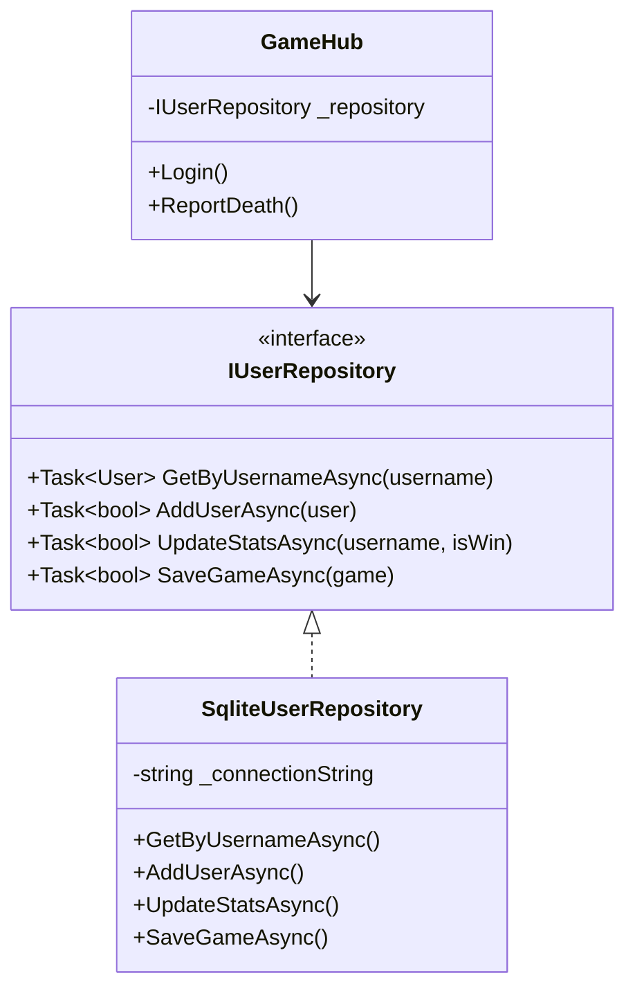

**Actual Implementation:**

```csharp
// Repository Interface
public interface IUserRepository
{
    Task<User?> GetByUsernameAsync(string username);
    Task<bool> AddUserAsync(User user);
    Task<bool> UpdateStatsAsync(string username, bool isWin);
    Task<IEnumerable<User>> GetTopPlayersAsync(int count);
    Task<bool> SaveGameAsync(GameHistory game);
}

// Concrete Repository
public class SqliteUserRepository : IUserRepository
{
    private readonly string _connectionString;

    public async Task<User?> GetByUsernameAsync(string username)
    {
        using var connection = new SqliteConnection(_connectionString);
        await connection.OpenAsync();

        var command = connection.CreateCommand();
        command.CommandText = "SELECT * FROM Users WHERE Username = @username";
        command.Parameters.AddWithValue("@username", username);

        using var reader = await command.ExecuteReaderAsync();
        if (await reader.ReadAsync())
        {
            return new User
            {
                Id = reader.GetInt32(0),
                Username = reader.GetString(1),
                // ... map all columns
            };
        }
        return null;
    }

    public async Task<bool> SaveGameAsync(GameHistory game)
    {
        using var connection = new SqliteConnection(_connectionString);
        await connection.OpenAsync();

        var command = connection.CreateCommand();
        command.CommandText = @"
            INSERT INTO GameHistory (Player1, Player2, Winner, Theme, PlayedAt)
            VALUES (@p1, @p2, @winner, @theme, @played)
        ";
        command.Parameters.AddWithValue("@p1", game.Player1);
        command.Parameters.AddWithValue("@p2", game.Player2);
        command.Parameters.AddWithValue("@winner", game.Winner);
        command.Parameters.AddWithValue("@theme", game.Theme);
        command.Parameters.AddWithValue("@played", game.PlayedAt.ToString("o"));

        return await command.ExecuteNonQueryAsync() > 0;
    }
}

// Consumer
public class GameHub : Hub
{
    private readonly IUserRepository _userRepository;

    public GameHub(IUserRepository userRepository)
    {
        _userRepository = userRepository;
    }

    public async Task<bool> Login(string username, string password)
    {
        var user = await _userRepository.GetByUsernameAsync(username);
        return user != null && VerifyPassword(password, user.PasswordHash);
    }
}
```

**Location:** `Bomberman.Services/Data/`

---

## 4. Database Design

### 4.1 Entity-Relationship Diagram

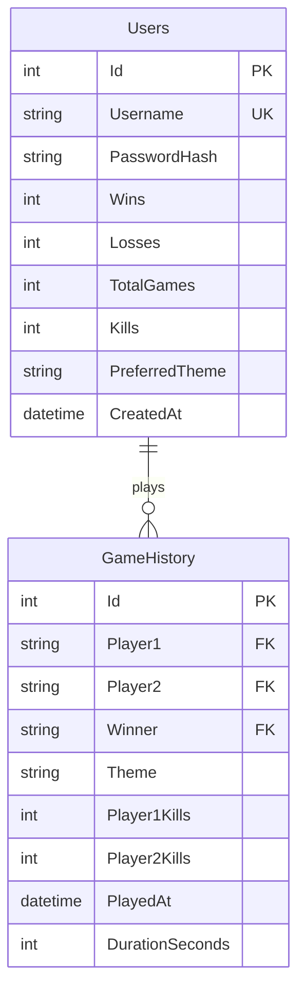

### 4.2 SQL Schema

```sql
CREATE TABLE Users (
    Id INTEGER PRIMARY KEY AUTOINCREMENT,
    Username TEXT UNIQUE NOT NULL,
    PasswordHash TEXT,
    Wins INTEGER DEFAULT 0,
    Losses INTEGER DEFAULT 0,
    TotalGames INTEGER DEFAULT 0,
    Kills INTEGER DEFAULT 0,
    PreferredTheme TEXT DEFAULT 'Forest',
    CreatedAt TEXT
);

CREATE TABLE GameHistory (
    Id INTEGER PRIMARY KEY AUTOINCREMENT,
    Player1 TEXT NOT NULL,
    Player2 TEXT NOT NULL,
    Winner TEXT NOT NULL,
    Theme TEXT NOT NULL,
    Player1Kills INTEGER DEFAULT 0,
    Player2Kills INTEGER DEFAULT 0,
    PlayedAt TEXT NOT NULL,
    DurationSeconds INTEGER DEFAULT 0
);
```

---

## 5. Multiplayer Architecture

### 5.1 Synchronization Strategy

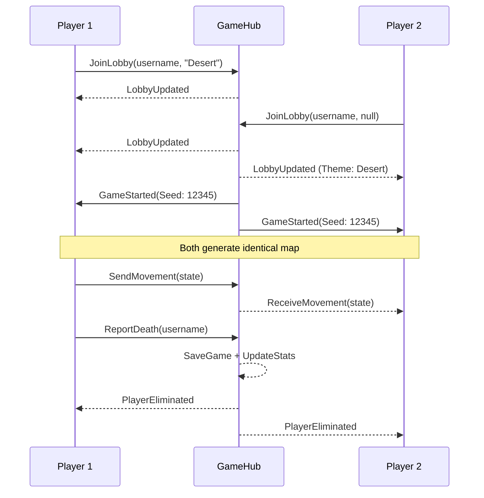

### 5.2 Network Protocol

**Client → Server:**
- `Login(username, password)` → `bool`
- `JoinLobby(username, theme)` → `void`
- `SendMovement(PlayerStateDTO)` → `void`
- `PlaceBomb(BombDTO)` → `void`
- `ReportDeath(username)` → `void`

**Server → Client:**
- `GameStarted(GameStartDTO)`
- `ReceiveMovement(PlayerStateDTO)`
- `ReceiveBombPlacement(BombDTO)`
- `PlayerEliminated(username)`

---

## 6. Conclusion

### 6.1 Pattern Summary

| Category | Patterns | Count |
|----------|----------|-------|
| **Behavioral** | Strategy, Observer, State | 3 |
| **Creational** | Abstract Factory, Builder, Factory Method | 3 |
| **Structural** | Decorator, Adapter | 2 |
| **Architectural** | Repository | 1 |
| **Total** | | **9** |

### 6.2 Achievements

✅ Exceeded requirement (9 patterns vs 4 required)  
✅ Real-time multiplayer with SignalR  
✅ Three themes with Abstract Factory  
✅ Hard walls (2-hit destruction)  
✅ Persistent game statistics  
✅ Professional UI/UX

---

**End of Design Document**
