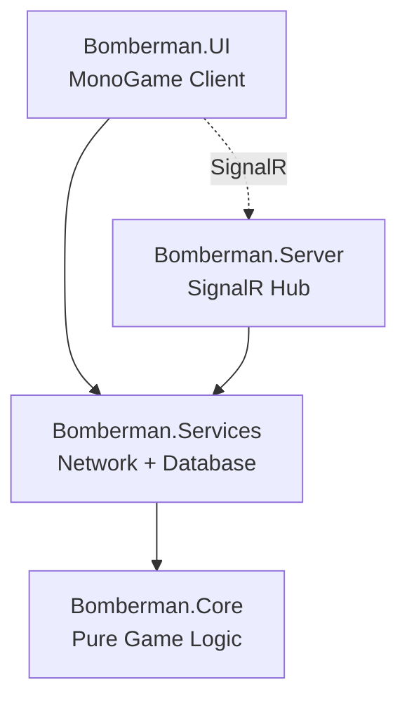
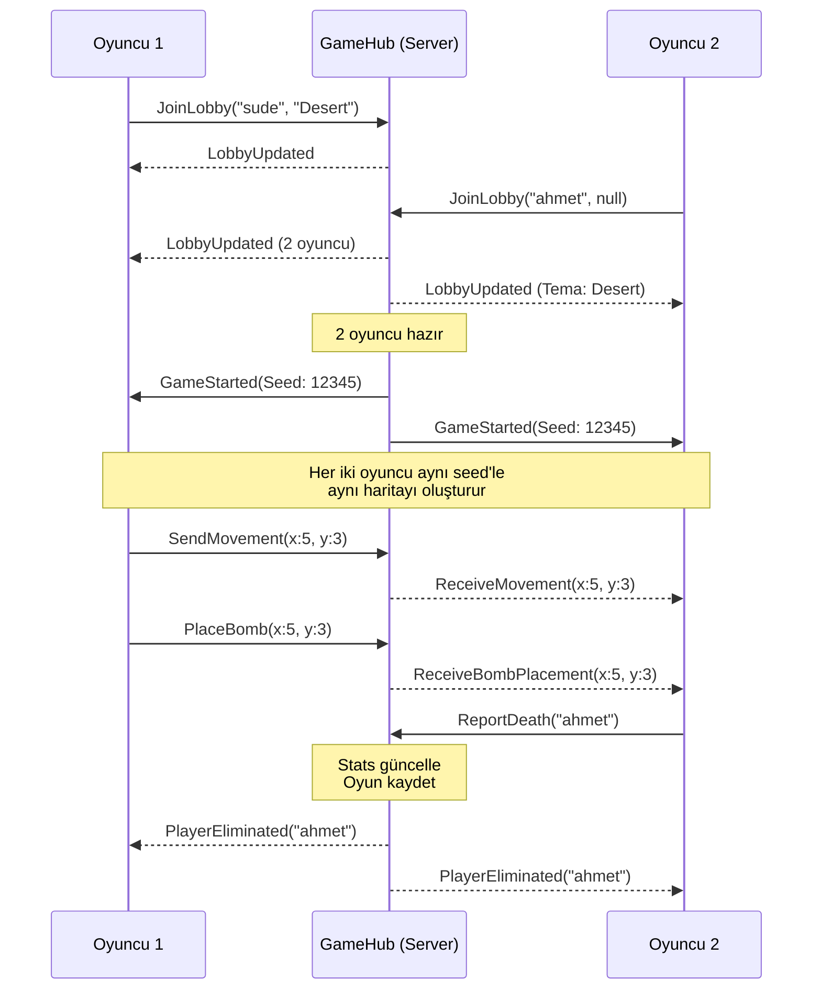
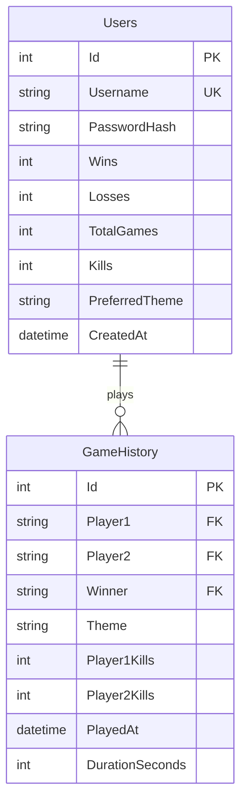

# 🎮 Bomberman Projesi - Kapsamlı Öğrenme Rehberi

**Sunum Tarihi:** 26 Aralık 2024  
**Ders:** Nesne Yönelimli Tasarım Desenleri  
**Öğrenci:** Sude Dincer

---

## 📚 İçindekiler

1. [Hızlı Başlangıç - İlk 5 Dakikada Bilmeniz Gerekenler](#hızlı-başlangıç)
2. [Proje Mimarisi](#proje-mimarisi)
3. [9 Tasarım Deseni - Detaylı Açıklama](#9-tasarım-deseni)
4. [Multiplayer Mimarisi](#multiplayer-mimarisi)
5. [Veritabanı Tasarımı](#veritabanı-tasarımı)
6. [Sunum İpuçları](#sunum-ipuçları)
7. [Sıkça Sorulan Sorular](#sıkça-sorulan-sorular)

---

## ⚡ Hızlı Başlangıç

### İlk 5 Dakikada Bilmeniz Gerekenler

> [!IMPORTANT]
> Bu projeyi eğer 5 dakikada anlatmanız gerekirse şunları söyleyin:

**Proje Nedir?**
- Real-time 2 oyunculu online Bomberman oyunu
- **.NET 8**, **MonoGame**, ve **SignalR** kullanılarak geliştirildi
- **9 tasarım deseni** uygulandı (gerekli olan 4'ün 2 katından fazla!)

**Ana Özellikler:**
1. ✅ Real-time multiplayer (SignalR ile)
2. ✅ 3 farklı harita teması (City, Desert, Forest)
3. ✅ 2 vuruş gerektiren "Hard Wall" sistemi
4. ✅ SQLite veritabanı ile kalıcı istatistikler
5. ✅ 3 farklı düşman AI davranışı

**Modül Yapısı:**
```
Core (Saf oyun mantığı) ← Services (Network + DB) ← UI (MonoGame)
                         ↕
                    Server (SignalR Hub)
```

**9 Tasarım Deseni:**

| Kategori | Desenler | Nerede Kullanıldı? |
|----------|----------|-------------------|
| **Behavioral (3)** | Strategy, Observer, State | Düşman AI, Patlama bildirimleri, Oyuncu durumları |
| **Creational (3)** | Abstract Factory, Builder, Factory Method | Tema duvarları, Harita oluşturma, Duvar tipleri |
| **Structural (2)** | Decorator, Adapter | Power-up'lar, SignalR wrapper |
| **Architectural (1)** | Repository | Veritabanı erişimi |

---

## 🏗️ Proje Mimarisi

### Modül Hiyerarşisi



### Klasör Yapısı

```
Bomberman/
├── Bomberman.Core/              # 🎯 Saf oyun mantığı (dependency YOK)
│   ├── Entities/                # Player, Enemy, Bomb sınıfları
│   ├── GameLogic/               # GameMap, çarpışma kontrolü
│   ├── Patterns/                # ⭐ TÜM DESIGN PATTERN'LER BURADA
│   │   ├── Behavioral/          # Strategy, Observer, State
│   │   ├── Creational/          # Abstract Factory, Builder, Factory Method
│   │   └── Structural/          # Decorator, Adapter
│   ├── PowerUps/                # Power-up sınıfları
│   └── Walls/                   # Wall tipleri (Factory Method)
│
├── Bomberman.UI/                # 🎮 MonoGame client
│   ├── Scenes/                  # Login, Lobby, Game, Leaderboard
│   └── View/                    # Rendering logic
│
├── Bomberman.Services/          # 🌐 Altyapı katmanı
│   ├── Network/                 # SignalR client (Adapter Pattern)
│   └── Data/                    # SQLite repository (Repository Pattern)
│
├── Bomberman.Server/            # 🖥️ ASP.NET Core SignalR Hub
│   └── GameHub.cs               # Multiplayer koordinasyon
│
└── Shared/                      # 📦 DTOs (Data Transfer Objects)
```

### Bağımlılık Akışı

> [!NOTE]
> **Core** hiçbir dış bağımlılığa sahip değil! Bu "Clean Architecture" prensibidir.

```
UI → Services → Core
UI ←(SignalR)→ Server
Server → Services (Database)
```

---

## 🎨 9 Tasarım Deseni

### 1️⃣ Strategy Pattern (Behavioral)

**Nerede:** `Bomberman.Core/Patterns/Behavioral/Strategy/`

**Amaç:** Düşmanların farklı hareket davranışlarını değiştirilebilir hale getirmek.

**Problem:** 3 farklı düşman tipi var:
- **Static:** Yatay gidip geliyor
- **Chasing:** Oyuncuyu takip ediyor
- **Random Walk:** Rastgele yönlere hareket ediyor

**Çözüm:** Her davranışı ayrı bir strateji sınıfı yap.

```csharp
// Interface
public interface IMovementStrategy
{
    (double DeltaX, double DeltaY) CalculateMovement(
        Enemy enemy,
        GameMap? map,
        IPlayer? targetPlayer);
}

// Strateji 1: Yatay hareket
public class StaticMovement : IMovementStrategy
{
    public (double DeltaX, double DeltaY) CalculateMovement(...)
    {
        // Sağa-sola gidip gelir, duvara çarparsa yön değiştirir
        double step = enemy.Speed * 0.05;
        double dx = (enemy.Direction == Direction.Right) ? step : -step;
        
        if (map.CheckCollision(nextX, nextY))
        {
            enemy.Direction = (enemy.Direction == Direction.Right) 
                ? Direction.Left 
                : Direction.Right;
        }
        return (dx, 0);
    }
}

// Strateji 2: Takip hareketi
public class ChasingMovement : IMovementStrategy
{
    public (double DeltaX, double DeltaY) CalculateMovement(...)
    {
        // Oyuncuya doğru hareket eder
        double dx = playerX > enemy.X ? step : -step;
        double dy = playerY > enemy.Y ? step : -step;
        
        // En büyük farka göre hareket et
        if (Math.Abs(playerX - enemy.X) > Math.Abs(playerY - enemy.Y))
            return (dx, 0);
        else
            return (0, dy);
    }
}

// Context (Düşman)
public class Enemy
{
    private IMovementStrategy _movementStrategy;
    
    public void SetMovementStrategy(IMovementStrategy strategy)
    {
        _movementStrategy = strategy;
    }
    
    public void Move()
    {
        var (dx, dy) = _movementStrategy.CalculateMovement(this, map, player);
        X += dx;
        Y += dy;
    }
}
```

**Kullanım:**
```csharp
var enemy1 = new Enemy();
enemy1.SetMovementStrategy(new StaticMovement());

var enemy2 = new Enemy();
enemy2.SetMovementStrategy(new ChasingMovement());
```

**Sunumda Vurgula:**
- Runtime'da davranış değiştirilebilir
- Yeni strateji eklemek kolay: sadece yeni sınıf yaz
- SOLID'in "Open/Closed Principle"'ını destekler

---

### 2️⃣ Observer Pattern (Behavioral)

**Nerede:** `Bomberman.Core/Patterns/Behavioral/Observer/`

**Amaç:** Bomba patladığında birden fazla nesneyi bilgilendirmek.

**Problem:** Bomba patladığında:
- Oyuncular hasar alabilir
- Düşmanlar ölmeli
- UI güncellenmeli
- Network'e bildirilmeli

**Çözüm:** Observer pattern ile tüm ilgililer otomatik bilgilendirilir.

```csharp
// Observer Interface
public interface IExplosionObserver
{
    void OnExplosion(int x, int y, int power);
}

// Subject (Observable)
public class GameMap : IExplosionSubject
{
    private readonly List<IExplosionObserver> _observers = new();
    
    public void RegisterExplosionObserver(IExplosionObserver observer)
    {
        if (!_observers.Contains(observer))
            _observers.Add(observer);
    }
    
    public void NotifyExplosion(int x, int y, int power)
    {
        foreach (var observer in _observers)
        {
            observer.OnExplosion(x, y, power);
        }
    }
}

// Observer 1: Oyuncu
public class BasePlayer : IExplosionObserver
{
    public void OnExplosion(int x, int y, int power)
    {
        // State pattern'a delege et
        _currentState.HandleExplosion(this, x, y, power);
    }
}

// Observer 2: Düşman
public class Enemy : IExplosionObserver
{
    public void OnExplosion(int x, int y, int power)
    {
        if (IsInExplosionRange(x, y, power))
        {
            IsAlive = false;
        }
    }
}
```

**Kullanım:**
```csharp
var map = new GameMap();
map.RegisterExplosionObserver(player1);
map.RegisterExplosionObserver(player2);
map.RegisterExplosionObserver(enemy1);

// Bomba patladığında
map.NotifyExplosion(5, 5, 2); // Tüm observer'lar otomatik bildirim alır
```

**Sunumda Vurgula:**
- Loose coupling (gevşek bağlılık)
- Yeni observer eklemek kolay
- Subject, observer'ların kim olduğunu bilmek zorunda değil

---

### 3️⃣ State Pattern (Behavioral)

**Nerede:** `Bomberman.Core/Patterns/Behavioral/State/`

**Amaç:** Oyuncunun durumuna göre (Alive/Dead) davranışını değiştirmek.

**Problem:**
- Canlı oyuncu hareket edebilir, patlamadan hasar alabilir
- Ölü oyuncu hiçbir şey yapamaz

**Çözüm:** Her durum için ayrı sınıf, davranış o sınıfta.

```csharp
// State Interface
public interface IPlayerState
{
    void HandleMove(BasePlayer context, double dx, double dy, GameMap map);
    void HandleExplosion(BasePlayer context, int x, int y, int power);
}

// State 1: Canlı
public class AlivePlayerState : IPlayerState
{
    public void HandleMove(BasePlayer context, double dx, double dy, GameMap map)
    {
        // Tam hareket mantığı - çarpışma kontrolü ile
        if (!map.CheckCollision(context.X + dx, context.Y + dy))
        {
            context.SetPosition(context.X + dx, context.Y + dy);
        }
    }
    
    public void HandleExplosion(BasePlayer context, int x, int y, int power)
    {
        // Patlamada mı?
        if (IsInExplosion(context, x, y))
        {
            Console.WriteLine("Oyuncu öldü!");
            context.TransitionTo(new DeadPlayerState()); // Durum değişimi
        }
    }
}

// State 2: Ölü
public class DeadPlayerState : IPlayerState
{
    public void HandleMove(BasePlayer context, double dx, double dy, GameMap map)
    {
        // Ölü oyuncu hareket edemez - hiçbir şey yapma
    }
    
    public void HandleExplosion(BasePlayer context, int x, int y, int power)
    {
        // Ölü oyuncu tekrar ölemez
    }
}

// Context
public class BasePlayer
{
    private IPlayerState _currentState = new AlivePlayerState();
    
    public void TransitionTo(IPlayerState newState)
    {
        _currentState = newState;
    }
    
    public void Move(double dx, double dy, GameMap map)
    {
        _currentState.HandleMove(this, dx, dy, map);
    }
    
    public void OnExplosion(int x, int y, int power)
    {
        _currentState.HandleExplosion(this, x, y, power);
    }
}
```

**Sunumda Vurgula:**
- if-else karmaşasını önler
- Yeni state eklemek kolay
- Her state'in kendi mantığı var

---

### 4️⃣ Abstract Factory Pattern (Creational)

**Nerede:** `Bomberman.Core/Patterns/Creational/`

**Amaç:** Tema-spesifik duvarlar oluşturmak (City, Desert, Forest).

**Problem:** Her temada aynı duvar tipleri var ama farklı görünüyorlar.

**Çözüm:** Her tema için ayrı factory.

```csharp
// Abstract Factory Interface
public interface IWallFactory
{
    Wall CreateWall(WallType type, int x, int y, GameMap map);
}

// Concrete Factory 1: Şehir teması
public class CityWallFactory : IWallFactory
{
    public Wall CreateWall(WallType type, int x, int y, GameMap map)
    {
        switch (type)
        {
            case WallType.Unbreakable:
                return new UnbreakableWall(); // Beton bloklar
            case WallType.Breakable:
                return new BreakableWall(x, y, map); // Tuğla duvarlar
            case WallType.Hard:
                return new HardWall(x, y); // Çelik duvarlar
        }
    }
}

// Concrete Factory 2: Çöl teması
public class DesertWallFactory : IWallFactory
{
    public Wall CreateWall(WallType type, int x, int y, GameMap map)
    {
        switch (type)
        {
            case WallType.Unbreakable:
                return new UnbreakableWall(); // Taş bloklar
            case WallType.Breakable:
                return new BreakableWall(x, y, map); // Kumtaşı
            case WallType.Hard:
                return new HardWall(x, y); // Sertleştirilmiş kil
        }
    }
}

// Concrete Factory 3: Orman teması
public class ForestWallFactory : IWallFactory
{
    public Wall CreateWall(WallType type, int x, int y, GameMap map)
    {
        switch (type)
        {
            case WallType.Unbreakable:
                return new UnbreakableWall(); // Ağaç gövdeleri
            case WallType.Breakable:
                return new BreakableWall(x, y, map); // Ahşap sandıklar
            case WallType.Hard:
                return new HardWall(x, y); // Taş kütükler
        }
    }
}
```

**Kullanım:**
```csharp
// Tema seçimine göre factory oluştur
IWallFactory factory = theme switch
{
    "City" => new CityWallFactory(),
    "Desert" => new DesertWallFactory(),
    "Forest" => new ForestWallFactory(),
    _ => new ForestWallFactory()
};

// Aynı kod, farklı temalar
var wall = factory.CreateWall(WallType.Breakable, 5, 5, map);
```

**Sunumda Vurgula:**
- Tema değişince sadece factory değişir, kod aynı kalır
- Yeni tema eklemek kolay: yeni factory yaz
- İlgili nesneler ailesi birlikte oluşturulur

---

### 5️⃣ Builder Pattern (Creational)

**Nerede:** `Bomberman.Core/Patterns/Creational/Builder/`

**Amaç:** Karmaşık GameMap nesnelerini adım adım oluşturmak.

**Problem:** Harita oluşturma çok adımlı:
1. Boyut belirle
2. Kenarlara duvar koy
3. İçe duvarlar ekle
4. Düşmanları yerleştir
5. Power-up'ları ekle

**Çözüm:** Builder pattern ile fluent interface.

```csharp
// Builder Interface
public interface IMapBuilder
{
    IMapBuilder SetSize(int width, int height);
    IMapBuilder PlaceBorders();
    IMapBuilder AddBreakableWalls(int count, int seed);
    GameMap Build();
}

// Concrete Builder
public class ClassicMapBuilder : IMapBuilder
{
    private GameMap _map;
    private readonly IWallFactory _wallFactory;
    
    public ClassicMapBuilder(IWallFactory factory)
    {
        _wallFactory = factory;
        _map = new GameMap();
    }
    
    public IMapBuilder SetSize(int width, int height)
    {
        _map.Width = width;
        _map.Height = height;
        _map.Walls = new Wall[width, height];
        return this; // Fluent interface için
    }
    
    public IMapBuilder PlaceBorders()
    {
        // Kenarlara kırılmaz duvarlar
        for (int x = 0; x < _map.Width; x++)
        {
            _map.Walls[x, 0] = _wallFactory.CreateWall(
                WallType.Unbreakable, x, 0, _map);
            _map.Walls[x, _map.Height - 1] = _wallFactory.CreateWall(
                WallType.Unbreakable, x, _map.Height - 1, _map);
        }
        return this;
    }
    
    public IMapBuilder AddBreakableWalls(int count, int seed)
    {
        var random = new Random(seed);
        for (int i = 0; i < count; i++)
        {
            int x = random.Next(1, _map.Width - 1);
            int y = random.Next(1, _map.Height - 1);
            
            // %30 ihtimalle Hard Wall
            var wallType = (random.Next(100) < 30) 
                ? WallType.Hard 
                : WallType.Breakable;
                
            _map.Walls[x, y] = _wallFactory.CreateWall(wallType, x, y, _map);
        }
        return this;
    }
    
    public GameMap Build()
    {
        return _map;
    }
}
```

**Kullanım:**
```csharp
// Fluent interface - okunabilir ve esnek
var map = new ClassicMapBuilder(desertFactory)
    .SetSize(15, 13)
    .PlaceBorders()
    .AddBreakableWalls(50, seed)
    .Build();
```

**Sunumda Vurgula:**
- Karmaşık nesne oluşturma basitleşir
- Okunabilir kod (fluent interface)
- Aynı builder farklı konfigürasyonlar için kullanılabilir

---

### 6️⃣ Factory Method Pattern (Creational)

**Nerede:** `Bomberman.Core/Walls/`

**Amaç:** Duvar tiplerini (Unbreakable, Breakable, Hard) oluşturmak.

**Problem:** 3 farklı duvar tipi var, her biri farklı davranır:
- **Unbreakable:** Hiç kırılmaz
- **Breakable:** 1 vuruşta kırılır
- **Hard:** 2 vuruş gerekir

**Çözüm:** Factory method ile doğru alt sınıfı oluştur.

```csharp
// Product (Abstract)
public abstract class Wall
{
    public bool IsDestroyed { get; protected set; }
    public abstract void TakeHit();
}

// Product 1
public class UnbreakableWall : Wall
{
    public override void TakeHit()
    {
        // Hiçbir şey yapma - kırılmaz
    }
}

// Product 2
public class BreakableWall : Wall
{
    public override void TakeHit()
    {
        IsDestroyed = true; // 1 vuruşta yıkılır
    }
}

// Product 3: Hard Wall - EN ÖNEMLİ ÖZELLIK!
public class HardWall : Wall
{
    public int HitsRemaining { get; private set; } = 2;
    
    public override void TakeHit()
    {
        HitsRemaining--;
        if (HitsRemaining <= 0)
        {
            IsDestroyed = true;
        }
    }
}
```

**Kullanım:**
```csharp
// Factory method ile oluşturma (IWallFactory içinde)
Wall wall = type switch
{
    WallType.Unbreakable => new UnbreakableWall(),
    WallType.Breakable => new BreakableWall(x, y, map),
    WallType.Hard => new HardWall(x, y), // 2 vuruş!
    _ => throw new ArgumentException()
};
```

**Sunumda Vurgula:**
- Hard Wall projenin özel özelliği (gereksinimlerden biri)
- Polymorphism sayesinde `TakeHit()` her duvar için farklı çalışır
- Yeni duvar tipi eklemek kolay

---

### 7️⃣ Decorator Pattern (Structural)

**Nerede:** `Bomberman.Core/Patterns/Structural/`

**Amaç:** Oyunculara dinamik power-up yetenekleri eklemek.

**Problem:** Power-up'lar birbirinin üzerine eklenebilir:
- Hız artışı + Ekstra bomba + Güçlü bomba

**Çözüm:** Decorator pattern ile yetenekleri sar.

```csharp
// Component Interface
public interface IPlayer : IExplosionObserver
{
    double GetSpeed();
    int GetBombPower();
    int GetMaxBombCount();
    void Move(double dx, double dy, GameMap map);
    (double X, double Y) GetPosition();
}

// Concrete Component
public class BasePlayer : IPlayer
{
    public double GetSpeed() => 1.0;          // Varsayılan hız
    public int GetBombPower() => 1;           // Varsayılan güç
    public int GetMaxBombCount() => 1;        // Varsayılan bomba sayısı
    
    public void Move(double dx, double dy, GameMap map)
    {
        _currentState.HandleMove(this, dx, dy, map);
    }
}

// Abstract Decorator
public abstract class PlayerDecorator : IPlayer
{
    protected readonly IPlayer _inner;
    
    public PlayerDecorator(IPlayer inner)
    {
        _inner = inner;
    }
    
    public virtual double GetSpeed() => _inner.GetSpeed();
    public virtual int GetBombPower() => _inner.GetBombPower();
    public virtual int GetMaxBombCount() => _inner.GetMaxBombCount();
    public virtual void Move(double dx, double dy, GameMap map) 
        => _inner.Move(dx, dy, map);
}

// Timed Decorator (süre sonunda kendini kaldırır)
public abstract class TimedPlayerDecorator : PlayerDecorator
{
    private float _remainingTime;
    
    public TimedPlayerDecorator(IPlayer inner, float duration) : base(inner)
    {
        _remainingTime = duration;
    }
    
    public void Update(float deltaTime)
    {
        _remainingTime -= deltaTime;
        if (_remainingTime <= 0)
        {
            // Zamanlayıcı bitti, decorator'ı kaldır
            Expire();
        }
    }
}

// Concrete Decorator 1: Hız artışı
public class SpeedBoostDecorator : TimedPlayerDecorator
{
    public SpeedBoostDecorator(IPlayer inner, float duration) 
        : base(inner, duration) { }
    
    public override double GetSpeed() => base.GetSpeed() * 1.5; // %50 daha hızlı
}

// Concrete Decorator 2: Bomba gücü
public class BombPowerDecorator : TimedPlayerDecorator
{
    public BombPowerDecorator(IPlayer inner, float duration) 
        : base(inner, duration) { }
    
    public override int GetBombPower() => base.GetBombPower() + 1; // +1 menzil
}

// Concrete Decorator 3: Ekstra bomba
public class ExtraBombDecorator : TimedPlayerDecorator
{
    public ExtraBombDecorator(IPlayer inner, float duration) 
        : base(inner, duration) { }
    
    public override int GetMaxBombCount() => base.GetMaxBombCount() + 1; // +1 bomba
}
```

**Kullanım:**
```csharp
// Başlangıç
IPlayer player = new BasePlayer();
Console.WriteLine(player.GetSpeed());      // 1.0
Console.WriteLine(player.GetMaxBombCount()); // 1

// Power-up topla - decorator'ları üst üste ekle
player = new SpeedBoostDecorator(player, 10f);
Console.WriteLine(player.GetSpeed());      // 1.5

player = new ExtraBombDecorator(player, 10f);
Console.WriteLine(player.GetMaxBombCount()); // 2

player = new BombPowerDecorator(player, 10f);
Console.WriteLine(player.GetBombPower());  // 2

// 10 saniye sonra otomatik sona erer
```

**Sunumda Vurgula:**
- Runtime'da yetenek ekleme/çıkarma
- Birden fazla decorator stack'lenebilir
- Timed decorator ile otomatik süre bitişi

---

### 8️⃣ Adapter Pattern (Structural)

**Nerede:** `Bomberman.Services/Network/`

**Amaç:** SignalR'ın karmaşık API'sini basit bir interface'e dönüştürmek.

**Problem:** SignalR'ın `HubConnection` sınıfı çok low-level:
- `InvokeAsync<T>()` 
- `On<TMessage>()`
- Connection management

**Çözüm:** Adapter ile domain-specific temiz interface.

```csharp
// Target Interface (Oyunun istediği)
public interface IGameClient
{
    Task<bool> LoginAsync(string username, string password);
    Task JoinLobbyAsync(string username, string? theme);
    Task SendMovementAsync(PlayerStateDTO state);
    
    event Action<PlayerStateDTO>? MovementReceived;
    event Action<BombDTO>? BombPlaced;
    event Action<string>? PlayerEliminated;
}

// Adapter (SignalR'ı sarar)
public class SignalRGameClient : IGameClient
{
    private readonly HubConnection _connection; // Adaptee
    
    public event Action<PlayerStateDTO>? MovementReceived;
    public event Action<BombDTO>? BombPlaced;
    public event Action<string>? PlayerEliminated;
    
    public SignalRGameClient(string hubUrl)
    {
        _connection = new HubConnectionBuilder()
            .WithUrl(hubUrl)
            .WithAutomaticReconnect()
            .Build();
            
        RegisterHandlers();
    }
    
    private void RegisterHandlers()
    {
        // SignalR callback'lerini event'lere dönüştür
        _connection.On<PlayerStateDTO>("ReceiveMovement", 
            state => MovementReceived?.Invoke(state));
            
        _connection.On<BombDTO>("ReceiveBombPlacement", 
            bomb => BombPlaced?.Invoke(bomb));
            
        _connection.On<string>("PlayerEliminated", 
            username => PlayerEliminated?.Invoke(username));
    }
    
    public async Task<bool> LoginAsync(string username, string password)
    {
        if (_connection.State == HubConnectionState.Disconnected)
            await _connection.StartAsync();
            
        return await _connection.InvokeAsync<bool>("Login", username, password);
    }
    
    public async Task JoinLobbyAsync(string username, string? theme)
    {
        await _connection.InvokeAsync("JoinLobby", username, theme);
    }
    
    public async Task SendMovementAsync(PlayerStateDTO state)
    {
        await _connection.InvokeAsync("SendMovement", state);
    }
}
```

**Kullanım:**
```csharp
// UI katmanında sadece temiz interface kullanılır
IGameClient client = new SignalRGameClient("http://localhost:5077/gamehub");

// SignalR detayları gizli
await client.LoginAsync("sude", "password123");

// Event subscription da kolay
client.MovementReceived += (state) =>
{
    opponent.UpdatePosition(state.X, state.Y);
};
```

**Sunumda Vurgula:**
- UI, SignalR'dan haberdar değil
- Test etmek kolay (mock IGameClient)
- Değişim kolaylığı (SignalR yerine başka teknoloji kullanılabilir)

---

### 9️⃣ Repository Pattern (Architectural)

**Nerede:** `Bomberman.Services/Data/`

**Amaç:** Veritabanı erişimini soyutlamak.

**Problem:** GameHub ve UI, SQL sorguları yazmamalı.

**Çözüm:** Repository pattern ile data access katmanı.

```csharp
// Repository Interface
public interface IUserRepository
{
    Task<User?> GetByUsernameAsync(string username);
    Task<bool> AddUserAsync(User user);
    Task<bool> UpdateStatsAsync(string username, bool isWin);
    Task<IEnumerable<User>> GetTopPlayersAsync(int count);
    Task<bool> SaveGameAsync(GameHistory game);
}

// Concrete Repository
public class SqliteUserRepository : IUserRepository
{
    private readonly string _connectionString;
    
    public SqliteUserRepository(string connectionString)
    {
        _connectionString = connectionString;
    }
    
    public async Task<User?> GetByUsernameAsync(string username)
    {
        using var connection = new SqliteConnection(_connectionString);
        await connection.OpenAsync();
        
        var command = connection.CreateCommand();
        command.CommandText = "SELECT * FROM Users WHERE Username = @username";
        command.Parameters.AddWithValue("@username", username);
        
        using var reader = await command.ExecuteReaderAsync();
        if (await reader.ReadAsync())
        {
            return new User
            {
                Id = reader.GetInt32(0),
                Username = reader.GetString(1),
                PasswordHash = reader.GetString(2),
                Wins = reader.GetInt32(3),
                Losses = reader.GetInt32(4),
                TotalGames = reader.GetInt32(5),
                Kills = reader.GetInt32(6),
                PreferredTheme = reader.GetString(7)
            };
        }
        return null;
    }
    
    public async Task<bool> UpdateStatsAsync(string username, bool isWin)
    {
        using var connection = new SqliteConnection(_connectionString);
        await connection.OpenAsync();
        
        var command = connection.CreateCommand();
        command.CommandText = isWin 
            ? "UPDATE Users SET Wins = Wins + 1, TotalGames = TotalGames + 1 WHERE Username = @username"
            : "UPDATE Users SET Losses = Losses + 1, TotalGames = TotalGames + 1 WHERE Username = @username";
        command.Parameters.AddWithValue("@username", username);
        
        return await command.ExecuteNonQueryAsync() > 0;
    }
    
    public async Task<IEnumerable<User>> GetTopPlayersAsync(int count)
    {
        var users = new List<User>();
        using var connection = new SqliteConnection(_connectionString);
        await connection.OpenAsync();
        
        var command = connection.CreateCommand();
        command.CommandText = "SELECT * FROM Users ORDER BY Wins DESC LIMIT @count";
        command.Parameters.AddWithValue("@count", count);
        
        using var reader = await command.ExecuteReaderAsync();
        while (await reader.ReadAsync())
        {
            users.Add(new User { /* ... */ });
        }
        return users;
    }
}
```

**Kullanım:**
```csharp
// GameHub'da
public class GameHub : Hub
{
    private readonly IUserRepository _userRepository;
    
    public GameHub(IUserRepository userRepository)
    {
        _userRepository = userRepository;
    }
    
    public async Task<bool> Login(string username, string password)
    {
        var user = await _userRepository.GetByUsernameAsync(username);
        if (user == null) return false;
        
        return VerifyPassword(password, user.PasswordHash);
    }
    
    public async Task ReportDeath(string username)
    {
        // Kaybedeni güncelle
        await _userRepository.UpdateStatsAsync(username, isWin: false);
        
        // Kazananı bul ve güncelle
        var winner = FindWinner();
        await _userRepository.UpdateStatsAsync(winner, isWin: true);
    }
}
```

**Sunumda Vurgula:**
- SQL sorguları tek yerden yönetilir
- Test için mock repository kullanılabilir
- Veritabanı değişirse (SQLite → PostgreSQL) sadece repository değişir

---

## 🌐 Multiplayer Mimarisi

### SignalR İş Akışı



### Deterministic Map Generation

> [!IMPORTANT]
> Harita senkronizasyonu için kritik: **Her iki oyuncu aynı seed ile aynı haritayı oluşturur!**

```csharp
// Server seed gönderir
await Clients.Caller.SendAsync("GameStarted", new GameStartDTO
{
    Seed = 12345,
    PlayerPositions = positions,
    Theme = selectedTheme
});

// Her iki client aynı seed'le harita oluşturur
var map = new ClassicMapBuilder(factory)
    .SetSize(15, 13)
    .PlaceBorders()
    .AddBreakableWalls(50, seed: 12345) // Aynı seed = aynı duvarlar!
    .Build();
```

**Neden Önemli?**
- Tüm haritayı network'ten göndermek yavaş olur
- Sadece seed gönderilerek bant genişliği tasarrufu
- Garanti: Aynı seed → Aynı Random → Aynı harita

---

## 💾 Veritabanı Tasarımı

### Tablo Şeması

```sql
-- Kullanıcı tablosu
CREATE TABLE Users (
    Id INTEGER PRIMARY KEY AUTOINCREMENT,
    Username TEXT UNIQUE NOT NULL,
    PasswordHash TEXT,
    Wins INTEGER DEFAULT 0,
    Losses INTEGER DEFAULT 0,
    TotalGames INTEGER DEFAULT 0,
    Kills INTEGER DEFAULT 0,
    PreferredTheme TEXT DEFAULT 'Forest',
    CreatedAt TEXT
);

-- Oyun geçmişi tablosu
CREATE TABLE GameHistory (
    Id INTEGER PRIMARY KEY AUTOINCREMENT,
    Player1 TEXT NOT NULL,
    Player2 TEXT NOT NULL,
    Winner TEXT NOT NULL,
    Theme TEXT NOT NULL,
    Player1Kills INTEGER DEFAULT 0,
    Player2Kills INTEGER DEFAULT 0,
    PlayedAt TEXT NOT NULL,
    DurationSeconds INTEGER DEFAULT 0
);
```

### ER Diagram



---

## 🎤 Sunum İpuçları

### Girişte Söyleyecekleriniz (2 dakika)

> "Merhaba, bugün size Bomberman Multiplayer projesini sunacağım. Bu proje .NET 8, MonoGame ve SignalR kullanarak geliştirilmiş real-time 2 oyunculu bir oyun. Proje boyunca **9 farklı tasarım deseni** uyguladım - bu derste istenilen 4 desenin 2 katından fazla. Projede Strategy, Observer, State, Abstract Factory, Builder, Factory Method, Decorator, Adapter ve Repository pattern'lerini kullandım."

### Her Pattern İçin Sunuş Formatı

1. **İsim ve Kategori:** "İlk desenimiz Strategy Pattern, Behavioral kategorisinden"
2. **Problem:** "Projemde şu problemi yaşadım: 3 farklı düşman tipi gerekiyordu..."
3. **Çözüm:** "Strategy pattern ile her davranışı ayrı sınıf yaptım"
4. **Kod Göster:** Kısa kod snippet (5-10 satır)
5. **Faydaları:** "Bu sayede runtime'da davranış değiştirebiliyorum, yeni strateji eklemek kolay"

### Demo Zamanı

> [!TIP]
> Canlı demo yapmak istiyorsanız:

1. **Server'ı başlatın:** `cd Bomberman.Server && dotnet run`
2. **İki client açın:** Ekranda yan yana gösterin
3. **Gösterecekleriniz:**
   - Login/Register
   - Tema seçimi (Abstract Factory!)
   - Farklı düşman davranışları (Strategy!)
   - Hard wall 2 vuruş (Factory Method!)
   - Power-up toplama (Decorator!)
   - Bomba patlaması (Observer!)
   - Leaderboard (Repository!)

### Sıkça Sorulan Sorulara Hazırlık

**S: Neden 9 desen kullandınız?**
> "Projenin farklı katmanlarında gerçek ihtiyaçlar vardı. Örneğin düşman AI için Strategy, network için Adapter, UI-backend ayrımı için Repository. Her desen organik bir şekilde ortaya çıktı."

**S: En zor pattern hangisiydi?**
> "Decorator pattern, çünkü timed decorator'ların otomatik expire olması gerekiyordu. Stack'lenmiş decorator'ları doğru yönetmek önemliydi."

**S: Hard wall özelliği nasıl çalışıyor?**
> "Factory Method pattern ile HardWall sınıfı, TakeHit() metodunda HitsRemaining değişkenini tutuyor. 2 vuruş sonra IsDestroyed true oluyor."

**S: Multiplayer senkronizasyon nasıl?**
> "Deterministic harita oluşturma kullanıyorum. Server seed gönderiyor, her client aynı seed ile aynı Random'ı kullanarak aynı haritayı generate ediyor. Sonra sadece player movement'ları senkronize ediliyor."

**S: Neden SignalR seçtiniz?**
> "WebSocket tabanlı, bi-directional real-time iletişim sağlıyor. ASP.NET Core ile native entegrasyon var ve groups, ConnectionId gibi özellikleri multiplayer için ideal."

---

## 🧠 Hızlı Hatırlatma - Son 10 Dakika

### Pattern'lerin Yerlerini Ezberle

| Pattern | Dosya Yolu | Anahtar Kelime |
|---------|-----------|----------------|
| **Strategy** | `Core/Patterns/Behavioral/Strategy/` | Düşman AI |
| **Observer** | `Core/Patterns/Behavioral/Observer/` | Bomba patlaması |
| **State** | `Core/Patterns/Behavioral/State/` | Alive/Dead |
| **Abstract Factory** | `Core/Patterns/Creational/` | City/Desert/Forest |
| **Builder** | `Core/Patterns/Creational/Builder/` | Harita oluşturma |
| **Factory Method** | `Core/Walls/` | Hard Wall |
| **Decorator** | `Core/Patterns/Structural/` | Power-up'lar |
| **Adapter** | `Services/Network/` | SignalR sarmalama |
| **Repository** | `Services/Data/` | SQLite |

### Kritik Özellikler

✅ **Real-time multiplayer** - SignalR ile  
✅ **3 tema** - Abstract Factory ile  
✅ **Hard wall (2 vuruş)** - Factory Method ile  
✅ **Power-up'lar** - Decorator ile  
✅ **3 AI davranışı** - Strategy ile  
✅ **Kalıcı stats** - Repository ile  
✅ **9 pattern** - Gerekenden 2x fazla!

### Son Kontrol Listesi

- [ ] Proje derleniyor mu? (`dotnet build`)
- [ ] Server çalışıyor mu? (`dotnet run` Bomberman.Server'da)
- [ ] Hangi pattern nerede kullanıldı biliyorum
- [ ] Her pattern'in örnek kodunu açıklayabilirim
- [ ] Hard wall özelliğini demo edebilirim
- [ ] Multiplayer senkronizasyonu anlatabiliyorum

---

## 📝 Özet Çizelge

| # | Pattern | Kategori | Nerede? | Ne için? |
|---|---------|----------|---------|----------|
| 1 | Strategy | Behavioral | Enemy AI | 3 hareket davranışı |
| 2 | Observer | Behavioral | Explosion | Bildirim sistemi |
| 3 | State | Behavioral | Player | Alive/Dead durumları |
| 4 | Abstract Factory | Creational | Themes | Tema-spesifik duvarlar |
| 5 | Builder | Creational | Map | Harita oluşturma |
| 6 | Factory Method | Creational | Walls | Hard wall (2 vuruş) |
| 7 | Decorator | Structural | Power-ups | Dinamik yetenekler |
| 8 | Adapter | Structural | Network | SignalR wrapper |
| 9 | Repository | Architectural | Database | Data access layer |

---

## 🎯 Başarı Dileği!

Bu rehberi okuduysanız projenize %100 hakimsiniz! Sunumda kendinize güvenin, her pattern'i gerçek ihtiyaçlardan yola çıkarak uyguladınız. 

**İyi şanlar! 🚀**
